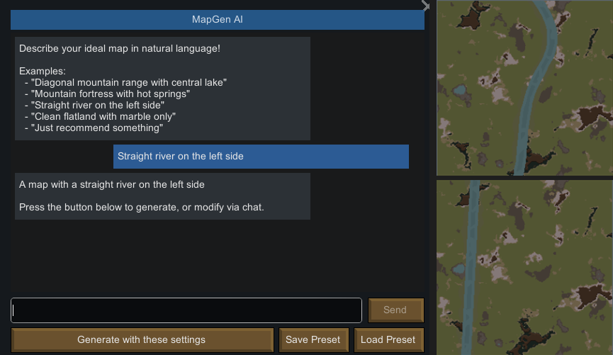

# MapGen AI

> **Current test build:** `dist` and the separate **MapGen AI [DEV]** package now contain the same verified DLL and translations for RimWorld 1.6. [한국어 모드 소개·사용법](docs/description-ko.md) covers the current features; image input remains paused. Enable one package at a time. The previous release is preserved at tag `v1.6`. This local package synchronization does not publish a Steam update or a new GitHub Release.



**Describe your map in natural language — AI generates it for you.**

A RimWorld mod that replaces manual UI sliders with an AI chat interface. Type anything like *"mountain fortress with hot springs"*, *"straight river on the left side"*, or *"just surprise me"* and watch the AI configure your map in real-time with Map Preview.

> The original version was built by [Claude Code](https://claude.ai/claude-code) (AI coding agent). The author has zero C# experience. Development continues with AI-assisted implementation and validation.

## Features

- **Natural Language Map Generation** — Describe terrain in plain text, AI converts it to map parameters
- **Live Map Preview** — See changes instantly through Map Preview integration
- **Elevation Shapes** — Diagonal mountain ranges, central lakes, ring fortresses, canyons, ridges, passages, and more
- **Explicit Dry Passages** — Connect ordered waypoints with a width in map cells. Existing shape behavior is preserved; generation reports remaining obstructions and protects world water.
- **Free-form Shapes** — Star, heart, crescent, and custom shapes via CSG/SDF composite system
- **Terrain Fill** — Paint areas with loaded permanent terrain materials, including Odyssey lava, cooled lava, soil, sand, gravel, mud, or ice
- **Positioned Ruins** — Place small ruined walls/floors inside a named shape or bounded location; full footprints and available space are checked
- **Terrain-relative Placement** — Place structures near river banks, water, mountain foothills or inner region edges, with minimum spacing; simple ruins support 90-degree rotations
- **Native Ancient Dangers** — Position the game's native temples, including difficulty-aware contents; previews show an orange reservation outline, while interiors generate in the full map
- **Images Paused** — Image entry and generation are disabled during text-first development; existing data is retained
- **River Control** — Direction, position, and straight river mode
- **MDP State** — Previous settings preserved across requests (add mountains, then lakes, then caves — nothing gets lost)
- **Terrain Tuning** — Rich soil density, vegetation, animals, ore, ruins, rock types, caves, geysers
- **Odyssey DLC Support** — 60+ tile mutators (hot springs, fjords, oasis, animal habitats, etc.)
- **Preset System** — Save and load your favorite map configurations
- **Iterative Refinement** — Keep chatting to tweak your map until it's perfect
- **Undo & Reset** — Made a wrong turn? **Undo** reverts to before your last message. **Reset** restores the tile to its original state. Both are one click.
- **Korean / English / Japanese / Chinese (Simplified)** — Full multilingual UI and AI responses

## Quick Start

1. Install this mod + [Map Preview](https://steamcommunity.com/sharedfiles/filedetails/?id=2800857642) (required)
2. Open **Mod Settings → MapGen AI**, select your LLM provider and enter your API key
3. On the world map, select a tile — click the **✦ AI Map Gen** button next to Map Preview
4. Describe your ideal map and hit Send!

## Supported LLM Providers

| Provider | Notes |
|----------|-------|
| Google Gemini | Free tier available |
| OpenRouter | Access to 100+ models (Gemini, Claude, etc.) |
| OpenAI | GPT-4o, etc. |
| Local LLMs | Ollama, LM Studio, or any OpenAI-compatible API |

## Example Prompts

- *"Diagonal canyon with a large central lake"*
- *"Mountain fortress with hot springs and a southern exit"*
- *"Fertile land between two mountain ranges"*
- *"Star-shaped hill on top, crescent lake on the bottom"*
- *"Straight river, horizontal, at the bottom. Mountains on top, huge lake in center. Hot springs, caves, more animals and plants, marble only"*

## Tips

- **Not sure what features are available?** Just ask! Type things like *"what ancient ruins are there?"*, *"what special terrain features can I add here?"*, or *"what rock types are available?"* and the AI will list the options for your current tile.
- **Undo and Reset are your safety net** — If the AI generates something you don't like, hit **Undo** to go back one step, or **Reset** to wipe everything and start fresh.

## Requirements

- [Map Preview](https://steamcommunity.com/sharedfiles/filedetails/?id=2800857642) (required dependency)
- An API key from Gemini, OpenAI, or a local LLM server

## Install (non-Steam)

1. Download the latest zip from [Releases](https://github.com/rucy74/MapGenAI/releases)
2. Extract to your `RimWorld/Mods/` folder
3. Enable in mod list

## Compatibility

- Current `dev` and `dist`: RimWorld 1.6
- Odyssey DLC — Supported (enables 60+ additional terrain mutators)

## Project Structure

```
dev/            — Full mod + source (development)
  About/        — Mod metadata + preview image
  Assemblies/   — Compiled DLL (build output)
  Defs/         — XML definitions
  Languages/    — Translations (Korean / English / Japanese / Chinese Simplified)
  Source/       — C# source code
dist/           — Release-ready (copy to RimWorld/Mods/)
docs/           — Dev logs, workshop description, prompt engineering notes
```

Promote an already verified, clean DEV archive without rebuilding its DLL:

```powershell
python tools/sync_release.py <MapGenAI-Dev.zip> <new-output-directory>
```

This updates `dist` and creates `MapGenAI.zip`, keeping the normal `Choco.MapGenAI` package identity. It does not install or publish the package. [Current synchronization checks](docs/analysis/2026-09-22-release-sync/report.md).

## License

MIT


## Validated recommendations (dev)

Recommendations now include independent executable patches. The application validates the complete options before displaying them; choosing a number or its button applies that stored patch with another preflight check and normal Undo support. Changed state invalidates old options. Generation still checks actual structure placement.

Oasis-like terrain requests compose a small irregular pool with localized fertile soil while preserving biome/feature constraints. Image input remains paused and its button is hidden. [Validation evidence](docs/analysis/2026-09-15-recommendations/report.md).

---
## 작성 이력
- 2026-09-15 00:34 — 추천 실행 계획 검증·저장 선택, 오아시스 주변 토양, 이미지 버튼 숨김.
