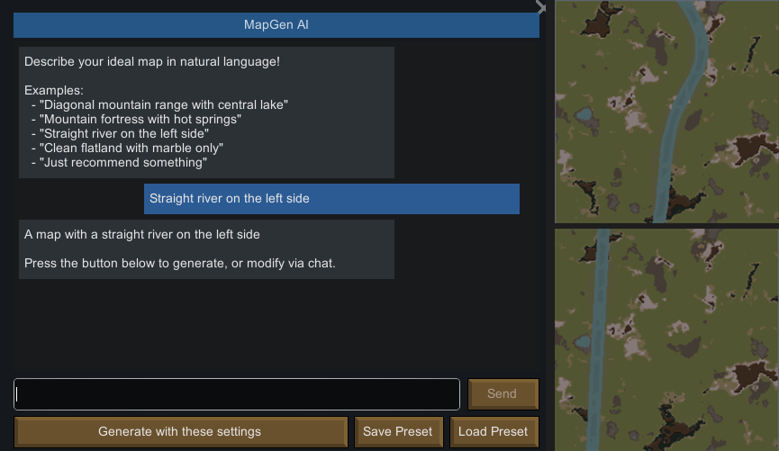

# MapGen AI

> **RimWorld 1.6.** Requires Harmony and Map Preview. Image input is paused in the current version. The previous release is preserved at tag `v1.6`. [한국어 모드 소개·사용법](docs/description-ko.md)



**Describe your map in natural language, and MapGen AI builds it.**

A RimWorld mod that replaces manual map sliders with an AI chat. Type things like *"a ring of mountains with a lake inside"*, *"move the river to the west side"*, or *"recommend a map"*, and Map Preview shows the result.

> The original version was built by [Claude Code](https://claude.ai/claude-code) (AI coding agent). The author has zero C# experience. Development continues with AI-assisted implementation and validation.

## Features

- **Natural language map generation:** describe terrain in plain text, and the AI turns it into map settings
- **Live Map Preview:** see each change through Map Preview
- **Edits keep what you built:** add a lake, then move it, resize it, or change only its outline. Earlier changes stay
- **Undo and Reset:** Undo steps back one request. Reset returns the tile to its original map
- **Map ideas with previews:** Quick suggestions draws up to three candidates with Map Preview. Refine one before you pick. Nothing changes until you choose
- **Preference questions:** answer a few multiple-choice questions before asking for ideas. They make no AI calls
- **Exact or natural shapes:** perfect circles, stars, hearts, rings, or natural outlines through the CSG/SDF composite system
- **Terrain fills:** paint areas with loaded permanent terrain, including Odyssey lava, or fill part of an area, like 70% rich soil
- **Positioned ruins and ancient dangers:** place ruins, or the game's own ancient dangers, by area, direction, or landmark
- **Local roads with bridges:** roads that cross a river or shallow water get wooden bridges automatically
- **Natural water:** natural lakes follow the game's own lake style, with shallow edges and lakeshore ground that suits the biome
- **Explicit dry passages:** connect ordered waypoints with a passage of a given width in cells
- **River and coast control:** straighten rivers, shift where they cross the map, and turn coasts. World river and coast connections stay intact
- **Odyssey and landmark mods:** hot springs, fjords, oasis, and other tile features when the DLC or mod is active and the tile allows them
- **Terrain tuning:** rich soil, vegetation, animals, ore, ruins density, rock types, caves, geysers
- **Presets:** save and load map settings
- **Images paused:** image input is disabled during text-first development. Existing data is retained
- **Languages:** menus in English, Korean, Japanese, and Simplified Chinese. Some newer messages are English or Korean only

## Quick Start

1. Install this mod, [Harmony](https://steamcommunity.com/sharedfiles/filedetails/?id=2009463077), and [Map Preview](https://steamcommunity.com/sharedfiles/filedetails/?id=2800857642)
2. Open **Mod Settings > MapGen AI**, pick your provider, enter your API key, and choose a model
3. On the world map, select a tile and click the **✦ AI Map Gen** button next to Map Preview
4. Type a request, or press **Quick suggestions** or **Find my preferences**
5. When the preview looks right, press **Generate with these settings**. The settings apply when you start or settle on that tile

## Supported LLM Providers

| Provider | Notes |
|----------|-------|
| Google Gemini | Default model `gemini-3.8-flash`. Used for most testing |
| OpenAI | |
| OpenRouter | Access to many models |
| DeepSeek | |
| Grok | |
| GLM, GLM (Coding) | |
| Alibaba (Intl), Alibaba (CN) | |
| Local | Ollama, LM Studio, or another OpenAI-compatible local server |
| Custom | Your own endpoint |

## Example Prompts

- *"A ring of mountains with a lake inside and one opening to the south."*
- *"Add a small island in the middle of the lake."*
- *"Move the island to the north side of the lake."* / *"Make the river straight."*
- *"Fill 70% of the ring's interior with rich soil."*
- *"Put two small ruins on the island."*
- *"Add a dirt road from the west edge to the east edge."*
- *"Add hot springs."* (Odyssey)
- *"Recommend a map."* / *"Make option 2 more natural."*

## Tips

- **Not sure what features are available?** Just ask! Type things like *"what ancient ruins are there?"*, *"what special terrain features can I add here?"*, or *"what rock types are available?"* and the AI will list the options for your current tile.
- **Not sure where to start?** Press **Quick suggestions**, or **Find my preferences** to answer a few questions first.
- **Undo and Reset are your safety net.** If the AI generates something you don't like, hit **Undo** to go back one step, or **Reset** to start fresh.

## Requirements

- [Harmony](https://steamcommunity.com/sharedfiles/filedetails/?id=2009463077) and [Map Preview](https://steamcommunity.com/sharedfiles/filedetails/?id=2800857642)
- An API key for your chosen provider, or a local OpenAI-compatible server

## Install (non-Steam)

1. Download the latest zip from [Releases](https://github.com/rucy74/MapGenAI/releases)
2. Extract to your `RimWorld/Mods/` folder
3. Enable in mod list

## Compatibility

- RimWorld 1.6
- Odyssey DLC: supported (hot springs, lava, and other tile features)
- Vanilla Landmarks Expanded: its tile features are read automatically when the mod is active

## Project Structure

```
dev/            — Full mod + source (development)
  About/        — Mod metadata + preview image
  Assemblies/   — Compiled DLL (build output)
  Defs/         — XML definitions
  Languages/    — Translations (Korean / English / Japanese / Chinese Simplified)
  Source/       — C# source code
dist/           — Release-ready (copy to RimWorld/Mods/)
docs/           — Dev logs, workshop description, prompt engineering notes
```

Promote an already verified, clean DEV archive without rebuilding its DLL:

```powershell
python tools/sync_release.py <MapGenAI-Dev.zip> <new-output-directory>
```

This updates `dist` and creates `MapGenAI.zip`, keeping the normal `Choco.MapGenAI` package identity. It does not install or publish the package. [Current synchronization checks](docs/analysis/2026-09-22-release-sync/report.md).

## License

MIT


## Validated recommendations (dev)

Recommendations now include independent executable patches. The application validates the complete options before displaying them; choosing a number or its button applies that stored patch with another preflight check and normal Undo support. Changed state invalidates old options. Generation still checks actual structure placement.

Oasis-like terrain requests compose a small irregular pool with localized fertile soil while preserving biome/feature constraints. Image input remains paused and its button is hidden. [Validation evidence](docs/analysis/2026-09-15-recommendations/report.md).

---
## 작성 이력
- 2026-09-15 00:34 — 추천 실행 계획 검증·저장 선택, 오아시스 주변 토양, 이미지 버튼 숨김.
- 2026-09-27 09:28 — 창작마당 새 소개글에 맞춰 기능·공급자(11종)·시작 방법·예시·호환 정보를 갱신하고, 일반판과 DEV가 같은 DLL이라는 시점 의존 문구를 뺐다.
