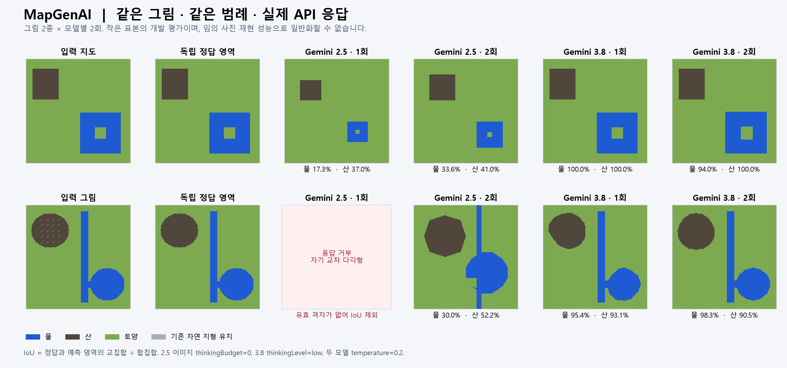

# MapGenAI 개발판 구현·검증 — 2026-09-13

기존 SDF 맵 생성기는 유지하고, 요청 해석·상태 적용·저장·검증 경계를 고쳤다. 이미지 입력은 별도의 지형 분류 레이어로 연결했다. 전면 재작성 없이 누적 편집의 기반을 교체한 1차 개발판이며, 임의 사진 재현과 이미지 외곽선 편집은 후속 작업이다.

사용자가 “gemini 성능 너무 거지같으면 blueprintai처럼 버전 높은 거 써도 돼”라고 허용했고, BlueprintAI의 실제 설정과 비교 실험을 확인해 개발판 Gemini 기본을 `gemini-3.8-flash`로 올렸다. 기존 Advanced 모델 선택은 유지하며, Simple에서도 3.8/2.5를 선택·저장할 수 있다. 무료 이용을 단정하던 안내를 제거했다.

## 바뀐 동작

| 문제·요구 | 개발판의 동작 |
|---|---|
| 산을 추가했는데 기존 호수나 특징이 사라짐 | 대화는 전달된 키만 반영한다. 전체 교체는 프리셋·명시적 교체로 구별한다. |
| 특정 지형만 이동·크기 변경 | 지형에 안정적인 ID를 주고 추가·수정·제거·상대 이동을 처리한다. 복합 도형·회전·좌표를 검증한다. |
| “완료”라고 하지만 바뀌지 않음 | 실제 상태 차이를 안내하고, 잘못된 응답·미지원 값·불완전 JSON은 적용하지 않는다. no-op·질문·실패는 Undo 이력을 늘리지 않는다. |
| Undo·Reset·프리셋에서 일부 값 소실 | 타일 전체 상태를 복제·복원한다. 복합 도형과 이미지 레이어를 프리셋 v2·Scribe에 저장한다. 기존 프리셋도 읽는다. |
| 타일 전환·응답 취소·생성 중 상태 충돌 | 요청 버전과 취소를 확인하고, 생성할 타일의 고정 상태를 사용한다. 생성 실패 시 공유 정의를 복원한다. |
| 월드 특징 제거·재추가와 다른 변경 충돌 | 원래 상태·직전 적용 상태를 별도로 보관하고 외부에서 추가한 특징을 보존한다. |
| 이미지·그림을 지형으로 변환 | PNG/JPEG와 EXIF 방향을 읽고 AI 다각형 해석 또는 팔레트 색상을 격자로 변환한다. 원본·분류도·해석 제한을 함께 표시한다. |
| 이미지의 일부만 고치기 | 연결된 영역을 클릭해 팔레트나 채팅으로 지형 종류를 변경한다. 초안 Undo 후 타일에 적용할 수 있다. 이미지 설명 칸에 범례를 적을 수 있다. |

토양 라벨은 기존 고도를 유지하고 산·물은 고도도 바꾼다. 자연 지형 라벨은 기존 생성 결과를 유지한다. 기존 SDF 도형은 이미지 레이어 위에 적용된다. 분류도는 실제 맵 미리보기가 아니므로 적용 후 Map Preview를 확인한다.

## Gemini 비교

같은 합성 그림 2종에 같은 범례를 주고 모델마다 2회 호출했다. 정답 격자는 모델과 독립적으로 만들었다. IoU는 정답과 예측 영역의 교집합을 합집합으로 나눈 값이다. 아래는 **각 유효 응답의 최솟값~최댓값**이며 실패 응답을 0으로 간주한 평균이 아니다.

| 모델 | 유효 응답 | 물 IoU | 산 IoU |
|---|---:|---:|---:|
| Gemini 2.5 Flash | 3/4, 자기 교차 다각형 1회 거부 | 17.3~33.6% | 37.0~52.2% |
| Gemini 3.8 Flash | 4/4 | 94.0~100% | 90.5~100% |



원본: [2.5 결과](provider-gemini25-legend/vision-results.json), [3.8 결과](provider-gemini38-legend/vision-results.json). 각 폴더의 instruction·response·state·truth 파일로 재현한다. 같은 범례가 없는 3.8 실험에서는 갈색을 토양으로 해석한 응답도 있어, 이번 결과를 모델만의 효과나 임의 사진의 성능으로 일반화하지 않는다. 범례의 효과와 모델 상향의 효과를 별도 실험으로 구분했다.

같은 범례 비교에서 3.8의 보고된 입력 토큰은 호출당 1,501, 출력 412~773, thinking 0이었다. 2.5의 유효 응답은 입력 670, 출력 374~550, thinking 0이었다. 이미지 토큰 산정이 모델마다 다르므로 이것만으로 비용 우위를 주장하지 않는다. 청구 비용과 일관된 지연 시간 측정은 이번 범위에 없다.

자연어는 산 추가→호수 크기 변경→고대 위협 1.8→하트 호수 추가→하트 호수 오른쪽 이동의 5개 요청에서 대상 변경과 다른 지형 보존을 모두 확인했다. [앞 3회](provider-gemini38-text/text-results.json), [복합 도형 2회](provider-gemini38-complex/text-results.json). 실제 게임에서 확보한 프롬프트 틀에 현행 shape 편집 계약·정본 상태를 넣고 production 소스를 링크한 클라이언트·파서·reducer로 평가했다. 모든 UI 언어·바이옴의 실호출 검증은 아니다.

## 검증과 실행 근거

| 검증 | 실제 결과 | 근거 |
|---|---|---|
| 모드 빌드 | 오류 0, 기존 CS7035 경고 1 | [빌드 로그](verification/final-build.log) |
| production 소스를 링크한 오프라인 회귀 | 58 PASS / 0 FAIL | [테스트 로그](verification/final-tests.log) |
| 실제 RimWorld 1.6 격리 프로필 | 31 PASS | [최종 실행](runtime-20260913-164506/result.json), [DLL·프로필 정보](runtime-20260913-164506/launch.json) |
| 실제 창 렌더 | 28 검사 PASS, 이미지 창 잘림 없이 육안 확인 | [창 캡처](runtime-20260913-163621/image-dialog.png), [결과](runtime-20260913-163621/result.json) |
| API 설정·배포본 보존 | 구성된 키·패턴 검사에서 발견 0, dist·설치 DLL 기준 해시 유지 | [검사 범위와 해시](verification/artifact-audit.json) |

최종 빌드 DLL SHA-256: `cd6be84b7da0c7c694953941b65aebf456bbd3aa6a410ff109cd4e5e41d1713c`.
UI 캡처 빌드는 바로 이전 `7627f797…`이며 이후 변경은 Gemini 모델명 Trim과 주석뿐이다.

실게임 검사는 실제 Scribe와 WorldComponent, Dialog 함수 경로, Unity PNG·vision 인코딩·방향 변환, 100×100 맵 생성을 사용했다. 중앙 호수 289/289 셀, 이미지 호수·섬의 지정 영역 400/400 셀에서 기대한 물/육지를 확인했다. 위험 밀도 1.8은 응답·상태·실제 scatter 범위·“위험 밀도 적용: 1.80” 로그까지 대조했다. 특정 난수 시드에서 위협 개체 수가 정확히 1.8배라는 뜻은 아니다.

의도적으로 생성 prefix 이후 예외를 발생시켜 generation context와 공유 정의 복원을 확인했다. 부분 생성된 Map 전체를 안전하게 재사용하는 것은 검증하지 않는다. 최종 실패 테스트는 결과 저장 후 격리 게임을 종료한다. 창 렌더 검사는 실패 주입을 생략한 별도 실행이다. UI의 실제 마우스 클릭 자동화, 실제 EXIF 사진의 전체 파이프라인, 사용자 세이브와 대규모 모드 조합, RimWorld 1.5는 미검증이다.

실행 명령(저장소 루트):

```powershell
dotnet build dev/Source/MapGenAI.csproj --nologo
dotnet run --project dev/Source/Tests/TextToMap.Tests.csproj
dotnet build tools/runtime-probe/RuntimeProbe.csproj --nologo
& tools/runtime-probe/launch.ps1
# 창 렌더 별도 실행
& tools/runtime-probe/launch.ps1 -Render
```

실 API 도구는 `tools/provider-probe/Program.cs`에 있다. 기본 오프라인 회귀는 API를 호출하지 않는다. 실호출에는 ignored `docs/dev_config.json`과 명시적 출력 경로를 사용한다. `MAPGENAI_PROBE_MODEL`, `MAPGENAI_PROBE_IMAGE_NOTES`로 모델·동일 범례를 지정하며 키를 결과에 기록하지 않는다.

## Fable 논의와 반증

실제 `claude-fable-5-1` 응답의 modelUsage를 확인했다. BlueprintAI의 기존 consult.py와 전용 CLI를 수정 없이 재사용했고, 요청·답변·JSON은 이 폴더에 보존했다. 설계, 응답 경계, 상태, 이미지 설계, 이미지 구현, 마지막 국소 검토, 모델 상향을 나누어 논의했다. 넓은 phase1 검토 1회는 300초 시간 초과였고 완료 검토로 세지 않는다.

- [상태 검토](fable-state-review.md): 외부 특징 추가·제거와 hilliness 보존, 옛 Def가 사라진 저장 상태의 복구 안내를 반영했다. 무조건 finally에서 타일 상태를 지우라는 제안은 보존 요구와 충돌해 채택하지 않았다.
- [이미지 구현 검토](fable-image-implementation-review.md): EXIF, 사진 크기 축소·JPEG fallback, 무효 저장 이미지의 명시적 복구를 반영했다. 입력이 먼저 지워진다는 지적은 실제 클라이언트 생성 순서로 반증했다.
- [최종 검토](fable-final-review.md): 토양이 산 고도를 평탄화하던 문제를 수정했고 축소 시 얇은 통로 손실을 경고한다. 다수결이나 임의 팽창이 재현성을 보장하지 않아 자동 도형 확장은 채택하지 않았다. 서로 다른 두 그림의 점수를 같은 입력의 변동성으로 해석한 부분은 정정했다.
- [모델 상향 검토](fable-model-upgrade-review.md): 3.8 기본화·선택값 보존·범례 입력을 검토했고 차단 결함은 제시하지 않았다. 모델명 Trim은 반영했다. 메타데이터 파싱 실패를 무시하자는 제안은 본문도 같은 엄격 파서를 쓰므로 채택하지 않았다. 클라이언트는 요청별 인스턴스로 사용한다.

자문은 실행 증거를 대신하지 않는다. HTTP 오류의 민감값을 제거한 상세 안내, Gemini 3 temperature 1.0과 현재 검증한 0.2의 비교는 후속이다.

## 실패에서 바꾼 점

1. 초기 2.5 자연어 응답이 `shape_ops`를 `params` 밖에 내보내 적용을 거부했다. 예시를 완전한 응답 JSON으로 바꾸고, 단독 루트 shape_ops만 엄격히 정규화했다. root/params 혼합이나 추가 루트 키는 거부한다. 이후 2.5의 5개 편집도 통과했다. 실패 원본은 `provider-thinking-off`에 있다.
2. Gemini 3.8에 `thinkingLevel=minimal`을 보낸 첫 실험은 HTTP 400이었다. 지원 표에 맞춘 `low`로 성공했다. `provider-gemini38` 실패 결과는 삭제하지 않았다. [Google thinking 지원 표](https://ai.google.dev/gemini-api/docs/generate-content/thinking).
3. 초기 런타임 도구는 DLC 순서 오류, 이미 맵이 있는 parent 재사용, 실패한 Map에서 렌더 계속 진행으로 실패했다. 각각 로드 순서·새 parent·실패 테스트와 렌더 분리로 고쳤다. 배치 렌더의 검은 이미지와 비활성 창의 프레임 정지는 비배치 실행·runInBackground로 해결했다. 실패 증거 폴더를 성공으로 취급하지 않는다.
4. 초기 실험 결과 저장기가 익명 객체를 직렬화하지 못해 반복 IoU를 누락했다. 실행 도구의 결과 저장을 System.Text.Json으로 바꿨고 과거 값은 저장된 격자에서 재계산했다. `provider-20260913/vision-results-recomputed.json`은 추가 호출 결과가 아니다.

## 남은 작업과 배포 경계

- 이미지 외곽선 이동·변형, 브러시, 건물 재현은 미구현이다. 현재 채팅 교정은 선택 영역의 지형 종류 변경이다.
- 사선 사진의 두 후보 계약은 파서에 구현했지만 실제 사진·사선 사진의 품질과 후보 다양성은 평가하지 않았다. 사진·다른 범례·가는 통로를 늘린 독립 정답 평가가 다음 작업이다.
- 이미지 격자를 더 작은 맵으로 축소하면 얇은 지형이 사라질 수 있다. 현재 맵 크기에 맞춰 입력 격자를 제한하고 경고하지만 완전 보존을 보장하지 않는다.
- 외부 모드 Worker의 임의 월드 부작용 복원, 모든 공급자의 vision API, 한국어 외 전체 UI 렌더와 오래된 실제 세이브는 추가 검증 대상이다.
- ImageGen 전용 공급자 선정은 사용자 기존 결정대로 보류했다.

보존 태그 `v1.6`은 `1439bbd`이며 변경하지 않았다. 개발은 `dev`에서만 진행했다. `main`, dist·게임 설치본, Steam 게시물은 이번 구현 대상이 아니다. 개발 패키지는 `tools/package_dev.py`로 별도 이름·packageId(`Choco.MapGenAI.Dev`)로 만든다. 기존 모드를 끄고 개발판을 켜는 방식으로 새 테스트 월드에서 확인할 수 있다. 정식 릴리스·기존 세이브 마이그레이션 완료를 뜻하지 않는다.
