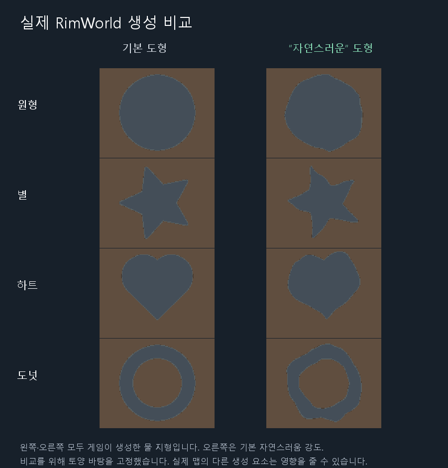

# 선택 가능한 자연스러운 도형 윤곽

2026-09-13. 기준 `dev@c1aef34`. 제품 DLL SHA256 `47ed3355aea76dfea7b4d02a1ae3e44c4c00e7c44806131ea9c4357cb89f9330`.

## 요구와 구현

사용자 요구: “원형이면 그냥 완전한 원형이고 자연스러운 원형하면 좀 그 자연스러운 원형 알지?” 일반 원·별·하트는 정확한 기하를 유지하고, 명시적 자연스러움/울퉁불퉁함만 윤곽에 반영한다. 물속 섬은 사용자 실제 테스트에서 생성됐으며, 용암 대신 물이 나온 문제와 유적 위치 지정은 후속이다.

- composite에 `edge_roughness`를 추가했다. 생략/none=0, low=.35, medium=.65, high=1 또는 숫자0~1. 기존 ridge의 noise_amount와 별개이며 다른 타입에는 거부한다.
- “자연스러운 원형 호수”, “살짝/많이 울퉁불퉁하게”, “다시 정확한 원형으로”를 KO/EN 시스템 프롬프트에 연결했다. 명시적 도형은 composite, 일반 호수는 기존 bump 경로다. 자연스러운 원형은 내부를 비우지 않는다.
- 도형 ID와 로컬 좌표로 결정되는 공유 좌표장을 세 번 변형하고 그 좌표로 기존 CSG/SDF를 평가한다. 모든 연산에 같은 변형을 사용한다. 축별 총 변위 상한은 강도×기준 크기×.09이며 전역 난수를 소비하지 않는다. 기본0에서는 새 경로를 건너뛴다.
- 옵션을 parser·validation·상태 설명·clone·Scribe·프리셋에 포함했다. update로 윤곽만 바꿀 때 나머지 필드는 보존하며 Undo로 이전 전체 상태를 복원한다. 기존 bump/ring의 Perlin 윤곽은 변경하지 않았다.

## 이번 실행의 검증

| 검증 | 명령/증거 | 결과 |
|---|---|---|
| 제품 빌드 | `dotnet build dev/Source/MapGenAI.csproj --nologo`, [build.log](build.log) | 오류0, 기존 자동 버전 경고1 |
| 오프라인 회귀 | `dotnet run --project dev/Source/Tests/TextToMap.Tests.csproj`, [로그](offline-tests-r2.log) | 70 PASS/0 FAIL |
| 실제 게임 | `tools/runtime-probe/launch.ps1 -Render -NaturalShapes -Language Korean -Output docs/analysis/2026-09-13-natural-shapes/native-r2` | 실제 Scribe·Dialog Undo·이미지 기존 회귀 포함 [33검사 PASS](native-r2/result.json), 전체 맵 생성 |
| 한국어 요청 | `dotnet run --no-build --project tools/provider-probe/ProviderProbe.csproj -- . docs/analysis/2026-09-13-natural-shapes/provider natural docs/analysis/2026-09-13-natural-shapes/native/production-edit-prompt-template.txt` (`MAPGENAI_PROBE_MODEL=gemini-3.8-flash`) | [실제7요청](provider/natural-results.json) 강도/대상/다른 상태 보존 모두 성공 |
| 별도 Claude 자문 | [설계 요청](fable-design-request.md)·[답변](fable-design-review.md), [최종 요청](fable-final-request.md)·[답변](fable-final-review.md) | 실제 claude-fable-5-1. 최종 P0/P1 없음. 합의 자체를 테스트로 취급하지 않음 |

새 회귀에는 원·별·하트·도넛×3강도, 반복 결정성, 이동 후 윤곽 보존, 좁은 도넛12시드의 연결/구멍, 잘못된 입력 거부, clone/프리셋/누적 편집 복원이 포함된다. 실제 Scribe fixture에는 medium이 저장되며 실제 대화창 함수의 적용/Undo도 별도로 확인했다.

512×512 실제 생성 결과이며 비교용 토양 바탕을 고정했다. 원/별/하트/도넛의 좌우 물 영역 차이는 각각399/577/683/857칸, 면적은 대체로 유지하면서 윤곽이 바뀐다. [관측값](native-comparison.json), [원본 캡처](native-r2/natural-shapes-generated-preview.png), [생성 정보](native-r2/natural-observations.json). 스크린샷은 게임의 Map Preview 색상을 그대로 캡처했고 비교 그림은 잘라 확대하고 제목만 추가했다.

## 실패·수정·한계

- 첫 시안은 원이 타원처럼만 보였다. [첫 캡처](native/natural-shapes-generated-preview.png)를 반려하고 짧은 파장을 더한 현재 변형으로 재생성했다.
- 첫 native result/observations는 SimpleJson이 익명 객체 속성을 직렬화하지 않아 `{}`로 기록됐다. 이 결과 파일은 합격 증거가 아니다. 도구를 Dictionary 출력으로 고쳐 native-r2에서 재실행했다. 두 실행 모두 [자동 정리](native-r2/cleanup.json)로 임시 모드를 삭제했다.
- 두 별도 실제 생성 실행의 정확한 도형 영역을 비교하면 총2칸 차이가 있다(원1/도넛1). 별도 월드 전체 생성의 비트 동일성은 주장하지 않는다. 옵션0/생략/none의 동일성은 동일 조건의 직접 SDF 회귀로 검증했다.
- .NET 테스트와 Mono 사이의 부동소수 결과가 비트 단위로 같다는 뜻은 아니다. 강체 회전과 같은 윤곽 회전, primitive 순서/ID 교체 후 동일 굴곡도 보장하지 않는다. 같은 ID와 기하를 다시 생성하거나 평행 이동하는 동작은 검증했다.
- 아주 좁은 통로·작은 홈은 셀 단위에서 사라질 수 있다. 기본 자연스러움은 형태를 알아볼 정도의 굴곡이며 침식 시뮬레이션은 아니다. 여러 도형으로 합친 큰 composite에서는 가장 큰 primitive가 기준 크기다.
- 실제 한국어 모델7요청은 해당 실행/모델 범위다. 모든 모델·모든 표현·다른 모드 조합을 검증한 것은 아니다. 자동화된 Dialog 함수와 실제 생성 검사이며 수동 마우스 조작 검사가 아니다.
- **용암 채움과 섬 위 특정 위치의 유적 배치는 이번 범위 밖이다.** 용암 TerrainDef를 검증해 채움 경로에 추가하고, 지형 마스크와 구조물 배치를 연결하면 구현 가능한 후속 작업이다. 현재 밀도 설정만으로 위치를 지정할 수 없다.

## 배포·기록

사용자 설명서는 [description-ko.md](../../description-ko.md)에 반영했다. 이 변경을 dev에 저장한 뒤 새 개발 ZIP을 만들며 sourceCommit/DLL은 패키지 manifest에 기록한다. 기존 태그/main·원본 MapGenAI·사용자 설정·세이브는 변경 대상이 아니다. 설치 영수증은 Codex 출력 패키지와 함께 보관한다. 다음 작업의 코드 진입점은 ContourWarp.cs와 ShapeEditPrompt.cs, 인계 정본은 RimWorld의 `agents/main/state-mapgenai.md`와 현재 트랙 로그다.
