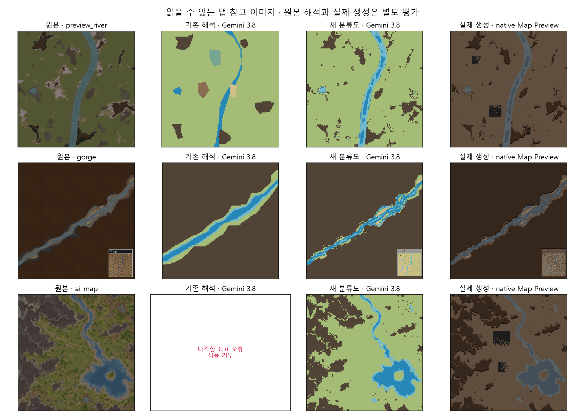

# MapGenAI 실제 참고 이미지 개선

2026-09-13 / `dev`, 개발 기준 `85886c5` / 보존판 `v1.6`은 유지.

실제 Map Preview·웹 지형 예시·AI가 그린 탑다운 맵을 범례 없이 평가하고, 원본 윤곽을 코드가 보존하며 AI가 지형 종류를 분류하는 경로를 기본으로 연결했다. 기존 자연어/SDF 생성기를 유지한 국소 개선이다. 일반 풍경의 분위기나 가려진 공간을 복원하는 범용 사진 생성은 대상이 아니다.

프론트에서는 PNG/JPEG를 불러와 설명 없이 해석할 수 있다. 설명은 선택 사항이며, 기본 해석은 원본 색상 구역의 배치를 보존한다. 기존 다각형 방식은 ‘윤곽을 AI가 다시 추론’ 옵션으로 남겼고 팔레트 가져오기·영역 클릭·지형 종류 교정도 유지했다. 새 ‘이미지·추가 도형의 높이를 월드 지형보다 우선’ 옵션은 저장·되돌리기와 함께 작동한다. 기존 저장 이미지의 기본값은 꺼짐이다.

백엔드는 제한된 색상 그룹과 원본/그룹 마스크 시트를 만든다. 모델은 각 그룹에 산·물·토양 등의 라벨만 반환하며 꼭짓점 수백 개를 다시 작성하지 않는다. 질감이 많은 그림은 블록 평균으로 축소하고 평면 색상 이미지는 점 샘플을 보존한다. 색상 탐지 샘플은 최대 16,384개로 제한한다. 일괄 평활화나 작은 영역 삭제는 가는 강·섬을 지울 수 있어 넣지 않았다. 범례를 요구하는 방식이 아니지만 비슷한 색을 공유하는 지형의 오분류는 남는다.

## 실제 결과와 한계

| 입력 | 기존 3.8 다각형 | 새 3.8 기본 경로 | 새 2.5 경로 |
|---|---|---|---|
| Map Preview | 강을 단순화하고 작은 지형 일부 누락 | 원본 강의 곡선과 흩어진 산 배치 개선, 일부 회색 지면 오분류 | 유효 결과, 일부 암석/지면 혼동 |
| 웹 협곡 | 대각선은 인식했으나 강폭을 과장 | 강폭·윤곽 보존 개선, 우하단 삽입 그림도 지형에 섞임 | 산을 토양으로 오해하는 중대한 오류 지속 |
| AI 탑다운 맵 | 다각형 자기 교차로 적용 거부 | 굽은 강·호수·섬 보존, 바위 경계와 얇은 물가 일부 혼동 | 대략적 배치 보존, 색상 경계 오류 지속 |

마지막 세 호출의 응답 시간은 3.8 약 2.6~3.2초, 2.5 약 3.8~4.8초였다. 전처리·실제 맵 생성 시간은 제외한 해당 실행의 관찰값이다. 모델 버전과 토큰 수는 [3.8 원본 결과](final-38/results.json), [2.5 원본 결과](final-25/results.json)에 남겼다. 재현 횟수가 적어 일반 성공률이나 평균 비용으로 해석할 수 없다. 3.8 기본 선택을 유지한다.

원본에서 사람이 표시한 국소 지점 59개의 최종 3.8 일치는 Map Preview 18/19, 협곡 15/16, AI 맵 18/24였다. 모델 출력을 본 이후 원본 위에서 위치를 검토한 **비맹검·수동 지점 검사**이며 전 픽셀 정답이나 전역 IoU가 아니다. 최초 지점 중 경계 밖/잘못된 지형에 놓인 좌표는 원본 표시를 보고 교정했다. 이 지점을 이용한 추가 모델 튜닝은 하지 않았다. 경계·연결성 평가는 비교 그림과 함께 봐야 한다. [주석 그림](landmark-annotation.png), [좌표](landmarks.json), [검사 원본](landmark-results.json).

실제 게임에서 분류도→생성 고도/물 그리드를 따로 대조했다. 세 샘플의 산·물 마스크는 해당 조건에서 모두 일치했다. 이것은 **AI가 원본을 정확히 읽었다는 100% 점수가 아니다.** 일반 광물 덩어리·유적·동굴·바이옴 색상 등은 별개다. 실제 암석 개체 검사에서는 이미지 밖 광물/암석이 33·7·98칸 남았다. [분류도→실제 생성 비교](generation-comparison.json), [Map Preview 런](generated-preview_river/result.json), [협곡 런](generated-gorge/result.json), [AI 맵/Valley 런](generated-valley-fixed/result.json).

입력 세 종만으로 전체 기능 완성을 선언하지 않는다. 특히 비슷한 색의 바위/토양, 얇은 강 가장자리, 작은 삽입 그림·UI는 추가 교정 대상이다. 외곽선을 직접 옮기는 교정·브러시·범용 사진 복원, 다양한 모드 조합/실제 사용자 세이브/RimWorld 1.5는 미검증 또는 후속이다. MG8의 남은 품질 작업을 유지한다.

## 생성 순서 문제 수정

산악 타일 한 실행에서 원치 않는 산이 3,407칸 추가됐다. 원래 타일의 mutator 기록이 없어 그 타일의 정확한 특징 이름은 확정하지 않았다. 이후 Valley를 명시한 격리 재현에서는 이미지 직후 추가 고도 산 0칸 → `MutatorPostElevationFertility` 직후 6,399칸이었다. [재현 추적](generated-ai-valley/generation-trace.json).

높이 우선 옵션을 켜면 이미지와 **후속 SDF 도형까지** 적용한 고도를 현재 생성 범위에 저장하고, Odyssey 고도 특징 처리 뒤 이미지의 자연 지형(N) 이외 칸만 복원한다. 새 옵션이 꺼진 과거 이미지와 N칸은 기존 의미를 유지한다. 모든 월드 특징을 삭제하지 않는다. 동굴·광물·식생 등 고도 이외 효과는 계속 작동하며 다른 모드의 고도 변경과의 우선순위는 옵션 의미와 함께 고려해야 한다.

수정 후 Valley 조건에서 추가/누락 고도 산은 0칸이고 실제 산 3,984/3,984칸, 물 1,717/1,717칸이었다. [수정 후 추적](generated-valley-fixed/generation-trace.json). 전후 실행의 월드/바이옴은 같지 않으며 같은 강제 Valley 조건에서 단계별 불일치 발생/제거를 확인한 것이다.

## 검증과 Fable

- `dotnet run --project dev/Source/Tests/TextToMap.Tests.csproj`: **62 PASS / 0 FAIL**. 얇은 물길·섬·고립 지형 보존, 잘못된 그룹 ID 거부, 기존 저장 의미, 모드 우선순위와 SDF/N칸/중첩 생성 복원 포함. [실행 로그](verification/final-tests.log).
- 실제 RimWorld 1.6.4871: **36 검사 PASS**, Scribe·부모 대화창 Undo·Unity·이미지+SDF·예외 복원 포함. [결과](runtime-priority-final/result.json). 실제 GUI 렌더는 별도 33검사 런에서 확인했고 직접 마우스 전 과정 자동화는 아니다. [창 캡처](runtime-render-final/image-dialog.png). 마지막 DLL은 옵션 해제 설명 문구를 보완한 뒤 렌더/33검사를 다시 확인한 버전이다.
- 생산 DLL 빌드 성공. 최종 재컴파일에서 기존 `1.0.*` 버전 경고 1개, 오류 0개. [빌드 로그](verification/final-build.log).
- 실제 `claude-fable-5-1` 자문: [입력 설계](fable-design-review.md), [생성 단계 원인](fable-generation-review.md), [최종 국소 검토](fable-final-review.md). 요청과 modelUsage JSON을 같은 폴더에 보존했다. 최종 지정 범위에서 P0/P1 지적 없음. 자문 합의를 테스트의 대체물로 취급하지 않았다. 최종 P2 중 옵션 해제 설명과 PowerShell 변수명은 반영했다.

Fable의 일괄 morphology 제안은 얇은 지형 보존 때문에 채택하지 않았다. 생성 수정도 mutator 목록 일괄 삭제/새 전용 worker 대신 생성별 고도 복원으로 구현하고 Valley 실험으로 확인했다.

## 임시 모드 정리

사용자에게 테스트용 모드가 다수 노출된 것은 종료 정리를 미룬 관리 결함이었다. 남아 있던 MapGenAI 임시 폴더 11개를 소유 marker·절대 경로·프로필·프로세스 확인 후 삭제했다. `launch.ps1`은 이제 숨김 정리 도우미를 시작하며, 게임 종료 후 해당 임시 모드만 삭제한다. 이후 실제 네 런에서 자동 삭제를 확인했다. [자동 삭제 예시](generated-valley-fixed/cleanup.json).

결과와 격리 프로필은 재현을 위해 보존한다. 도우미가 재부팅 등으로 중단되면 `tools/runtime-probe/cleanup.ps1 -Manifest <해당 launch.json>`으로 다시 정리할 수 있다. 실행 중인 테스트는 종료시키지 않고 삭제를 보류한다. 다른 모드나 사용자의 설치본을 정리 대상으로 삼지 않는다.

## 입력 출처와 재현

- `preview_river`: 저장소 기존 `docs/assets/before.png`, 실제 Map Preview 예시.
- `gorge`: 기존 `docs/assets/ref_examples/landform_07.jpg`; 기존 download.py의 7번째 Steam 이미지 출처. 우하단 삽입 그림을 제거하지 않은 실제 웹 예시로 실패를 숨기지 않았다.
- `ai_map`: 이번 실제 ImageGen 생성물 `ai-map.png`. 외부 AI 맵을 사용자가 가져오는 시나리오이며 모드 내부에 이미지 생성 공급자를 추가하지 않았다. [생성 요청 원문](reference-prompt.txt).

원본/전처리/응답/실패는 이 폴더에 보존했다. `baseline-*`는 기존 다각형, `colors-*`는 마스크 없는 색상 분류, `atlas-*`는 첫 마스크 실험, `final-*`는 Map Preview 규칙을 반영한 마지막 결과다. 서로 다른 단계의 성능을 최종 점수에 섞지 않았다.

저장소 루트에서 `python -X utf8 tools/real-image-report.py`로 저장된 결과 그림과 분류도→생성 지표를 다시 만든다. 실제 재호출은 `tools/provider-probe`의 `real` 모드와 `MAPGENAI_PROBE_IMAGE_MODE=atlas`, `MAPGENAI_PROBE_MODEL=gemini-3.8-flash`를 사용한다. 설정 키는 ignored `docs/dev_config.json`에만 있으며 증거/개발 ZIP에는 포함하지 않는다.
