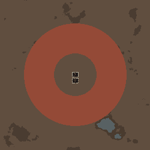

# 텍스트 영역·용암 채움·폐허 위치 지정 / 이미지 일시 중단

작성: 2026-09-13T23:56:22+09:00. 제품 기준 `dev`의 `a9b1c38`에서 구현. 배포 커밋과 설치 결과는 패키지 manifest/설치 영수증에 기록한다.

사용자 요청은 텍스트 우선 개선을 이어가면서 이미지 입력 기반 기능을 다시 다루기 전까지 끄는 것이다. Fable/Claude 자문 호출은 **0회**다.

## 구현한 동작

- 이미지 버튼·대화창 생성·직접 적용을 차단했다. 생성별 스냅샷에서 이미지 층을 제외하고 이미지 높이 복원도 작동하지 않는다. Scribe·프리셋·Undo의 기존 이미지 데이터와 관련 소스는 보존한다. 재활성화 설정은 제공하지 않는다.
- 기존 SDF·bump·ring 계산에서 실제 내부 마스크와 재료 층을 저장해 채움과 구조물 배치가 공유한다. 합성 도형의 구멍·자연스러운 윤곽을 그대로 사용한다.
- 활성 영구 TerrainDef 재료를 해석한다. `lava`는 실제 `LavaDeep`, `cooled_lava`는 `CooledLava`다. 화산암·자갈과 다른 적합한 재료도 같은 경로다. 없는 재료를 물로 바꾸지 않는다. 임시 `LavaShallow`, 바다·강·도로·다리·건축 바닥 등은 이 채움 목록에서 제외한다.
- 최종 재료는 단계400에서 적용하며 이미 생성한 강·바다·도로를 보호하고 제외한 칸 수를 안내한다. 통행 불가 지형의 자연 암석과 명시적 평탄화 영역을 정리한다. 깊은 용암의 열·화상·통행 불가 속성은 게임 정의 그대로다.
- `structure_ops`로 ID별 추가/수정/삭제, 참조 영역·좌표·경계·가로세로 크기·개수를 저장한다. 현재는 화강암 벽/바닥이 손상된 `ruin` 한 종류다. 지붕·적·전리품·고대 위협 시설은 포함하지 않는다.
- 모든 건물의 전체 면적이 허용 영역 안에 들어가고 물/용암/도로/막힌 암석/기존 건물/예약 공간과 충돌하지 않는지 검사한다. 공간 부족이면 위치 지정 폐허 batch를 생성하지 않고 이유를 표시한다. 크기나 위치를 몰래 바꾸지 않는다. 원래 자연 폐허 밀도는 독립적이다.
- 실제 생성 단계800에서 폐허를 배치한다. Map Preview는 Thing 생성을 막으므로 동일한 벽 계획을 텍스처에 표시한다. 실제 맵의 다른 건물 때문에 최종 위치는 달라질 수 있으며 생성 때 다시 검사한다.
- 도형 삭제 시 참조 중인 폐허도 함께 제거하거나 다시 연결해야 한다. 잘못된 참조/크기/종류는 상태 변경과 Undo 기록 전에 거절한다. 프리셋·Scribe·깊은 복사·현재 상태/변경 안내에 구조물 계획을 포함했다.

## 검증 결과

| 검증 | 결과 | 근거 |
|---|---|---|
| 제품 빌드 | 오류0, 기존 버전 형식 CS7035 경고1 | [빌드](final-build.log) |
| 오프라인 회귀 | 90 PASS / 0 FAIL | [회귀](final-tests.log) |
| 텍스트 영역/폐허 실제 맵 | 11맵 + 실제 배경 Map Preview, 117검사 PASS | [최종 결과](native-verified/result.json) |
| 지리 정책·VLE 회귀 | 6맵, 60검사 PASS | [VLE 결과](geography-verified-vle/result.json) |
| Gemini 3.8 한국어 독립 요청 | 10개: 변경7·제한안내3, 의도/보존 PASS | [모델 결과](provider-r1/text-region-results.json) |
| 실제 대화창 모델 응답 재생 | 10응답 적용/안내/Undo, 그중 새 용암 섬·폐허 요청은 완성 맵까지 생성 | [최종 실제 검증](native-verified/result.json) |
| 실제 Scribe | 새 구조물+도형+비활성 이미지 보존, 구조물 필드 없는 이전 fixture 읽기 PASS | [저장](native-verified/structures-scribe.xml), [이전 형식](native-verified/structures-legacy.xml) |

최종 제품 DLL SHA256: `dbf21afce52d912137310c9a91c5914c794b50f208cf98d15f16b0a64883bb8f`. 두 최종 실제 실행의 launch.json에서 같은 DLL임을 확인했다. 모델 응답은 초기 제품 프롬프트에서 받은 원문을 보존했고 최종 제품의 실제 Dialog에 재생했다. 모델 추가 호출로 성공 응답만 선별하지 않았다. 최종 원격/설치 전에 제품 DLL을 다시 빌드하지 않는다.

런타임 로그에는 Mono fallback library 메시지, native의 기본 AncientMechs 배치 공간 탐색 실패1건, VLE 한국어 번역3오류 메시지가 남았다. 최종 실행의 예외나 위 검사 실패는 없었으며, 기본 scatterer의 배치를 모든 맵에서 보장하거나 번역 오류를 해결했다는 뜻은 아니다. 원문 Player.log를 함께 보존했다.

실제 맵의 생성 후 TerrainDef와 Spawned Wall을 검사했다. 용암 숫자는 물을 포함하지 않는다. `capacity-failure`는 작은 영역 때문에 요청한 폐허 전체를 미생성하도록 만든 실패 fixture이며 정상 처리 여부를 검사했다.

| 사례 | LavaDeep 칸 | 위치 지정 폐허 | 실제 벽 | 판정 |
|---|---:|---:|---:|---|
| capacity-failure | 18956 | 0 | 0 | 공간 부족 안내 (의도한 실패) |
| image-paused | 18956 | 2 | 53 | 통과 |
| lava-island | 18956 | 2 | 53 | 통과 |
| materials | 3269 | 0 | 0 | 통과 |
| model-lava-from-scratch | 21216 | 1 | 29 | 통과 |
| model-ruin-island | 18600 | 2 | 36 | 통과 |
| moved-island | 15840 | 2 | 53 | 통과 |
| natural-lava | 18812 | 2 | 53 | 통과 |
| northeast-position | 0 | 3 | 90 | 통과 |
| raised-island | 18956 | 0 | 0 | 통과 |
| water-to-lava | 18956 | 0 | 0 | 통과 |



## 실패·수정 이력

1. 첫 컴파일의 `RegionGrid` 이름 충돌3건은 Verse의 동명 타입과 명시 alias로 구분했다.
2. 첫 회귀2건은 이전의 lava 미지원 기대와 테스트 helper의 FormatException 한정 catch였다. 재료 지원은 새 활성 정의 검증으로 검사하고 이미지 차단은 실제 InvalidOperationException을 확인하도록 갱신했다.
3. native-r1은 초기 제품7맵63검사 PASS다. 최종 증거로 합산하지 않는다.
4. native-r2는 모델 응답 재생과9개 실제 맵을 통과했으나, probe가 초기화되지 않은 MapPreviewGenerator.Instance를 사용해 마지막에 실패했다. 실제 Init 진입을 사용하도록 harness를 수정했다. [원본 실패](native-r2/error.txt).
5. preview-r1에서는 Map Preview가 GenSpawn을 차단해 벽 표시가 빠졌다. 게임 구조물 생성 성공으로 보지 않았으며, 미리보기는 동일 벽 계획을 직접 표시하고 실제 맵만 Spawn하도록 보완했다. preview-r2의3검사와 최종 native-verified의 실제 배경 미리보기 검증으로 확인했다. [실패](preview-r1/result.json), [보완 확인](preview-r2/result.json).

6. 마지막 코드 대조에서 평탄화한 섬 위에 나중에 추가한 산까지 지우는 순서 문제를 발견했다. 후속 높이 편집이 실제로 바꾼 셀은 앞선 평탄화에서 제외하도록 수정했다. 오프라인 회귀 90개와 최종 `raised-island` 실제 맵으로 확인했다. 이전 `native-final`의 10맵110검사와 `geography-final-vle`의 6맵60검사는 수정 전 이력이며 최종 DLL 증거와 구분한다.

## 범위와 다음 단계

- 전체 재작성은 하지 않았다. 영역·재료·배치 검사를 재사용하고 다른 구조물 종류의 생성기를 추가할 수 있는 구조다. 외부 모드용 공개 등록 API는 아직 없다.
- 현재 구조물은 단순 벽/바닥 폐허다. 고대 위협·퀘스트 구조물·다른 모드 건물, 회전·산 가까이·가장자리 관계의 자동 배치는 후속이다.
- Map Preview는 다른 자연 구조물을 생략하므로 실제 배치 위치가 같다고 보장하지 않는다. 실제 생성 때의 공간 부족도 화면에서 확인하고 계획을 수정한다.
- 직접 채움과 모든 외부 모드 생성 단계의 조합을 검증한 것은 아니다. 이번에는 대표 재료/도형, 실제 VLE6맵과 지리 조건 회귀를 확인했다. 임시 얕은 용암·모든 DLC 비활성 조합·모든 모드 재료의 완성 맵은 미검증이다. DLC 정의 부재 거절은 오프라인 활성 목록 fixture와 실제 없는 재료로 검사했다.
- 새로운 월드와 합성 저장 fixture를 사용했다. 실제 오래된 사용자 세이브, 1.5, 모든 공급자/하위 모델/언어, 전체 마우스 조작은 검증하지 않았다.
- 이미지 개선·재활성화와 Fable 호출은 사용자 재허용 전까지 중단한다. 정식 main/Steam/GitHub Release는 갱신하지 않는다.

## 재현

```powershell
dotnet build dev/Source/MapGenAI.csproj --no-restore -v minimal
dotnet run --project dev/Source/Tests/TextToMap.Tests.csproj --no-restore
dotnet build tools/runtime-probe/RuntimeProbe.csproj --no-restore -v minimal
tools/runtime-probe/launch.ps1 -TextRegions -Language Korean -TextResponses <응답폴더> -Output <새결과폴더>
tools/runtime-probe/launch.ps1 -FeaturePolicy -Landmarks -Language Korean -Output <새결과폴더>
```

실행마다 고유 모드 폴더/새 marked 프로필을 쓰고 종료 후 자체 marker를 확인해 임시 모드만 정리한다. 다른 작업과 사용자 게임을 종료하지 않는다. 계정 키는 ignored 개발 설정에서 읽고 결과에 기록하지 않는다. 설치 패키지에도 키·probe·사용자 설정은 넣지 않는다.

프로젝트 인계는 기존 `mapgenai` 트랙의 state/log/TODO를 갱신한다. 공유 `track_rimworld.md`는 다른 트랙 소유권 미인계로 수정하지 않으며 새 사용자 결정은 기존 state의 메모리 반영 대기에 출처와 함께 보존한다.
