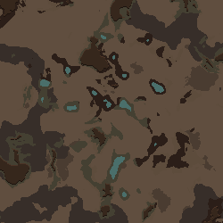

# 모드 특징 인식·온천·응답 형식 수정

2026-09-14 23:39 KST. 기준 dev `00cba5b`에서 수정. 검증 제품 DLL SHA-256 `fd65655b5a4e4d05f83941b29c2099f751ed245fb3f3364f12f8cf584163b68e`.

## 원인과 변경

사용자 활성 목록에는 Harmony·게임/DLC·Map Preview·MapGen AI DEV만 있었고, 설치되어 있는 Vanilla Landmarks Expanded(VLE)는 활성화되지 않았다. MapGen AI는 활성 DefDatabase에서 특징/재료를 자동으로 읽는다. 따라서 VLE가 빠진 게임에서 그 특징이 없다는 판단은 맞지만, 기능 자체가 없다고 단정하는 표현은 부정확했다. 프롬프트에 미로드와 부재를 구별하도록 명시했다. 사용자 설정을 임의로 변경하지 않았다.

| 사용자 이름 | 제공 콘텐츠 | 특징 ID |
|---|---|---|
| 비옥한 화산 토양 | Vanilla Landmarks Expanded | VEE_VolcanicRichSoil |
| 비옥한 비 | Vanilla Landmarks Expanded | VEE_FertileRains |
| 온천 | Odyssey | HotSprings |
| 별 보기 좋은 곳 | Vanilla Landmarks Expanded | VEE_SkygazingSpot |
| 빈번한 오로라 | Vanilla Landmarks Expanded | VEE_FrequentAuroras |
| 화창함 | Odyssey | SunnyMutator |
| overgrown | Vanilla Landmarks Expanded | VEE_PlantLife_Overgrown |

VLE의 필수 선행 모드는 Vanilla Expanded Framework이며 Odyssey도 필요하다. VLE와 선행 모드를 활성화하고 게임을 재시작하면 목록에 반영된다. 비옥한 화산 토양의 **재료** ID는 특징과 별개인 `VEE_VolcanicSoilRich`다. 전체 특징 추가와 특정 영역 재료 채움 모두 실제 생성으로 확인했다. [실제 로드된 특징 출처](native-vle-final/feature-sources.json), [사용자 활성 목록](user-evidence/active-mods.xml).

온천은 내가 도입했던 조건 검사가 자연발생 바이옴·산악 조건을 직접 추가에도 강제해 막고 있었다. 실제 native worker는 중심부 물/주변 암반과 고도를 스스로 생성하며 산악 지형에 의존하지 않는다. 정확히 이 native worker에만 biomeWhitelist와 min/maxHilliness 예외를 적용했다. 다른 특징, 외부 subclass, 바이옴 제외 목록, 강·해안 충돌, 온도/오염/도로 등의 조건은 그대로 검사한다. 월드 강·바다 연결 보존과 내륙 해안 금지도 유지한다.

`Unexpected JSON value (JSON offset 0)`는 실제 모델이 JSON 대신 일반 문장으로 답한 경우였다. strict parser 자체를 느슨하게 바꾸지 않고 `StructuredChat.SendAsync`에서 형식 오류만 같은 요청/상태/카탈로그로 공급자별 한 번 재요청한다. 설명은 ask JSON으로, 수정은 generate JSON으로 받아 기존 적용 검증에 넘긴다. 재요청도 잘못되면 설정을 변경하지 않고 오류를 알린다. 취소와 네트워크 오류를 형식 복구로 재시도하지 않는다. API 호출이 추가될 수 있다.

## 실제 검증

- [회귀검사](final-tests.log): 108 PASS / 0 FAIL. 유효 응답의 단일 호출, 일반문장·빈값·누락 envelope 복구, 연속 형식 실패 중단, 취소/전송 오류, 평지 온천 허용과 강/해안/외부 worker 제한을 포함한다.
- [제품 빌드](build.log): 오류0. 기존 자동 AssemblyVersion `1.0.*`의 CS7035 경고1. 이후 제품 DLL은 재빌드하지 않았다.
- Gemini 3.8 Flash 한국어 요청6종과 기록된 일반문장의 제한적 형식복구1종. 총 실제 API8호출 중 초기 온대림 요청 HTTP503 한 건은 보존했고, 해당 요청만 새 호출해 성공했다. 나머지5종은 첫 응답 성공. 형식복구는 기록된 실패문장을 첫 응답으로 주입하고 다음 답변을 실제 API로 받은 별도 시험으로, 자연 발생 첫 성공에 합산하지 않는다. [초기 결과/503](provider-core-r1/results.json), [해당 요청 재호출](provider-core-hot-retry/results.json), [VLE 한국어 요청](provider-vle-r1/results.json).
- 실제 Dialog에7응답을 재생하고 Undo/ask 상태 보존 확인. 최종 완성맵9개·배경 Map Preview2개·총63검사 PASS. [기본 활성 목록 검사](native-core-verified/result.json), [VLE 활성 검사](native-vle-final/result.json). 앞선 r2 5맵/34검사를 중복 합산하지 않았다.
- 평지 온대림과 열대우림에서 실제 온천수 확인. VLE7특징 조합으로 실제 비옥 화산 토양·온천수·별보기 GameCondition 확인. [조합 관찰](native-vle-final/model-combo-observation.json), [영역 채움 관찰](native-vle-final/model-rich-fill-footprint.json).



## 실패 보존과 검증 범위

native-core/vle-r1은 새 테스트 콜백의 static `Action<MapPreviewResult>` 필드 때문에 Lunar 구성요소 로드 전 타입 열거에 실패했다. 해당 격리 프로세스만 소유권 확인 후 종료·정리했다. 콜백이 local 경로를 capture하도록 테스트 코드만 수정하고 이후 정상 실행을 확인했다. 제품 오류로 집계하지 않는다.

native-vle-verified의 추가 면적 검사는 반지름 .20에 기본 falloff .05가 더해지는 기존 채움 규칙을 누락해 .22 바깥 토양을 실패 처리했다. 최종 검사는 .26 바깥 토양0과 중심부90% 이상을 확인하고 실측을 저장한다. 기본 생성 폐허가 나중에 바닥을 놓을 수 있다. 해당 실패/출력은 보존하며 정확한 면적비 검증으로 주장하지 않는다.

날씨·사건 특징은 실제 특징 등록과 조합 생성까지 검증했다. 오로라·비옥한 비가 이후 플레이에서 정해진 빈도로 발생하는지 장시간 시뮬레이션한 것은 아니다. 임의 외부 모드/모든 타일/모든 공급자 품질을 보장하지 않는다. 이미지 기능과 Fable 호출은 계속 중단 상태다.

별도 발견: 사용자 “70%” 후속이 산 높이 .95→.7 수정으로 해석된 로그가 있다. 이 대화 문맥/면적비 문제는 이번 특징 인식·온천 수정 범위에서 해결하지 않았다. 이전 F03 첫 용암 미반영 원인도 미확정이다.

## 재현 명령

저장소 루트에서 실행한다. ignored `docs/dev_config.json`은 실제 API를 새로 호출할 때만 필요하다.

```powershell
dotnet run --project dev/Source/Tests/TextToMap.Tests.csproj --no-restore
dotnet build dev/Source/MapGenAI.csproj --no-restore
dotnet build tools/runtime-probe/RuntimeProbe.csproj --no-restore
./tools/runtime-probe/launch.ps1 -FeatureFeedback -FeedbackResponses docs/analysis/2026-09-14-feature-feedback/provider-core-selected -Language Korean -Output <새 기본검사 폴더>
./tools/runtime-probe/launch.ps1 -FeatureFeedback -Landmarks -FeedbackResponses docs/analysis/2026-09-14-feature-feedback/provider-vle-r1 -Language Korean -Output <새 VLE검사 폴더>
dotnet run --project tools/provider-probe/ProviderProbe.csproj -- . <새 응답 폴더> feedback <native 프롬프트 폴더> [기록된 일반문장 경로]
```

기존 모드 목록/세이브를 사용하지 않는 격리 프로필에서 실행하고, 종료 후 소유 marker로 확인한 임시 모드 폴더만 정리한다. `MAPGENAI_FEEDBACK_CASE=hot-temperate`는 실패한 한 요청만 새로 시험하는 선택자다.

---
## 작성 이력
- 2026-09-14 23:39 — VLE 미활성 원인, 온천 과잉 조건 수정, 형식복구, 실제 생성/모델 검증 및 남은 범위 기록.
