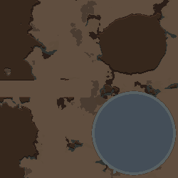
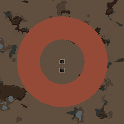

# D04 마른 통로 / F03 용암 해자 — 수정·재현 기록

2026-09-14. 기준 브랜치 `dev`, 수정 전 HEAD `4401841`(문서), 제품 기준 `99d648e`. 수정 후 검증 DLL SHA256: `0759f7031d699212f47d334d57122556c4fda11d5a356c6f1c2c3d0fac7a4b14`.

## 사용자 보고와 원인

- **D04:** 협곡 통로가 가로 직사각형 호수로 생성됨. [사용자 화면](user-evidence/d04-user-preview.png), [첫 응답](user-evidence/line-0257-response.json), [재시도 응답](user-evidence/line-0294-response.json).
- **F03:** 두 번째 시도에 성공. 첫 시도는 사용자가 “용암으로 바꿨다고 답했지만 물이 남았어”라고 확인했다. [접수 기록](user-evidence/receipt.json).

D04 두 응답 모두 직사각형에 `e:-1.2`를 보내고 `fill`을 생략했다. 현재 composite는 구버전 호수 호환을 위해 **fill 없는 음수 고도 = 물**로 처리한다. AI가 다른 지형의 음수 높이 깎기와 composite 호수 표기를 혼동할 수 있게 되어 있었다. 기존 프롬프트에는 작은 양수 높이의 절대 평탄화 설명도 빠져 있었다. 기록된 첫 응답을 그대로 실제 맵에 적용하자 같은 물길이 재현됐다.

F03의 첫 실패를 일으킨 응답/직전 상태 조합은 식별하지 못했다. 개인 게임 로그에는 해당 해자의 용암 변경 응답이 한 건만 있고, 사용자 요청은 기록되지 않는다. [남아 있는 용암 응답](user-evidence/line-0576-response.json)은 실제 맵에서 정상 적용됐다. 따라서 첫 실패의 원인을 확정하거나 단일 코드 버그를 고쳤다고 주장하지 않는다.

## 수정

1. KO/EN 시스템 프롬프트의 고도 설명과 호수 예시를 정리했다. 마른 통로·협곡·평탄 부지는 `fill:soil` + `e:0.05`, 호수는 `fill:water`를 명시한다. 지정한 폭/방향과 양쪽 연결을 안내하고, 원래 D04 테스트 문장은 바꾸지 않았다.
2. `SdfComposite.ApplyComposite`에서 명시 재료가 있을 때도 `0<e<0.1`을 **기존 높이에 더하지 않고 절대 평지 높이로 교체**한다. 흙을 채운 통로가 초기 생성 단계에서 산으로 남을 수 있는 차이를 제거했다. 기존 구버전 무채움 음수 고도의 호수 의미는 유지한다.
3. 해자 전체의 재료만 바꿀 때는 기존 ID에 `changes:{"fill":"LavaDeep"}`만 보내도록 안내를 강화했다. sub/out/add 도형·구멍·섬·폐허를 다시 작성할 필요가 없다. 여러 재료 중 일부를 바꿀 때는 기존 최상위 덮어쓰기 여부도 고려하도록 설명한다.

제품 변경: `dev/Source/MapGen/SdfComposite.cs`, `TextRegionPrompt.cs`, `dev/Source/UI/Dialog_TextToMap.cs`. 재현 도구: `ManualFailureTests.cs`, `tools/provider-probe/ManualFailureBench.cs`, `tools/runtime-probe/ManualFailureProbe.cs`와 실행 진입점.

## 실제 검증

| 검증 | 결과 |
|---|---|
| 순수 계산·파서·상태 회귀 | **103 PASS / 0 FAIL**. 마른 흙 통로의 초기 절대 높이, 먼 호수 보존, 구버전 implicit 호수 저장 복원, out/add 해자 재료 교체 포함 |
| Gemini 3.8 독립 첫 요청 | **9/9 의도·기존 상태 보존**. D04 동일 원문 3회, F03 동일 원문을 실제 기록의 두 시작 상태에서 각각 3회. 앞선 성공 답변이나 재시도 지시 없이 호출 |
| 격리 RimWorld 1.6 완성맵 | **12개**, 실제 Dialog/Undo·Scribe 및 배경검사와 합쳐 **82 PASS** |
| D04 새 모델 응답 | 3개 완성맵 모두 검사 통로 1,600칸에서 물0/산바위0, 제한된 폭 안 동서 보행 경로 존재. 남동 호수·북동 산 보존 |
| F03 새 모델 응답 | 6개 완성맵 모두 해자 내부 검사 9,816칸이 실제 `LavaDeep`, 물0. 중앙 섬 건조, 폐허2개 실제 벽 존재 |
| 실제 Map Preview 백그라운드 | D04/F03 **2개**. 실제 생성 map의 지형을 독립 관측, 이미지 저장. D04 마른 통로/기존 지형, F03 실제 용암/섬/폐허 계획 확인 |
| 기존 동작·차단 | 구버전 호수, 실제 Undo/Scribe, 이미지 기능 OFF 확인. 세계지도 연결 정책은 변경하지 않음 |

완성맵 12개는 D03 기준1 + 기록된 D04 오류1 + 기록된 F03 정상 응답1 + 새로운 모델 응답9개다. 과거 검증 맵/첫 검사 실행을 더해 부풀리지 않았다. 임시 모드는 [자동 정리](native-verified/cleanup.json)했다.

- [오프라인 결과](offline-tests.log), [제품 빌드](build.log), [모델 9응답 결과](provider-r1/results.json), [실제 게임 결과](native-verified/result.json).
- [D04 실제 통로 관측](native-verified/d04-1-observation.json), [F03 실제 용암 관측](native-verified/f03-1-observation.json).
- [D04 배경 미리보기 관측](native-verified/d04-1-background-observation.json), [F03 배경 미리보기 관측](native-verified/f03-1-background-observation.json).

### D04 수정 후 실제 미리보기



### F03 재료 변경 후 실제 미리보기



## 검증 중 실패와 제한

- `native-r1`은 12완성맵 검사 후 배경 미리보기의 산 보존 검사에서 실패했다. Map Preview는 산 바위 Thing 생성을 생략하는데 검사기가 실제 edifice를 요구했다. preview 검사만 고도0.7 이상/동굴 없음으로 고쳐 `native-verified`를 실행했다. 실제 완성맵에서는 여전히 바위 Thing과 통행 가능 여부를 검사한다. [첫 실행 실패](native-r1/result.json)는 보존했다. 이 수정으로 제품 DLL이 바뀌지는 않았다.
- 기존 세계/seed 자체를 복원한 검사는 아니다. 사용자의 실제 응답/수정 상태를 새 평지·내륙·온대림 타일의 250×250 맵에 재생했다. Harmony, Map Preview 및 설치된 공식 DLC를 사용했다. Fable 호출0, 이미지 기능 계속 OFF.
- 통로와 기존 강·바다 연결의 충돌, 모든 곡선·모드·타일·하위 모델을 확인한 것은 아니다. 기존 강/도로/해안 보호 정책이 적용된다. 3회/6회 표본은 모든 자연어 요청의 성공률 보장이 아니다.
- F03 최초 실패 원인은 계속 미확정이다. 같은 증상이 다시 나오면 요청·응답·직전 설정·미리보기 결과를 함께 확보해야 한다.

## 재현 명령

저장소 루트 기준. 실제 모델 실행은 로컬의 무시된 `docs/dev_config.json` 설정과 키를 사용하며 키는 근거/패키지에 포함하지 않는다. 아래 출력 경로는 새 경로를 사용한다.

```powershell
dotnet run --project dev/Source/Tests/TextToMap.Tests.csproj --no-restore
dotnet build dev/Source/MapGenAI.csproj --no-restore -v minimal
dotnet build tools/runtime-probe/RuntimeProbe.csproj --no-restore -v minimal
./tools/runtime-probe/launch.ps1 -ManualFailures docs/analysis/2026-09-14-manual-fixes/user-evidence -Output work/manual-prompt-new -Language Korean
# 위 격리 게임의 result.json/cleanup.json 완료 후:
$env:MAPGENAI_PROBE_MODEL='gemini-3.8-flash'
```

provider의 정확한 인수 순서는 `<저장소 절대경로> <새 응답 출력폴더> manual <캡처 폴더>`다. 이번 실제 실행은 다음과 같다.

```powershell
dotnet run --project tools/provider-probe/ProviderProbe.csproj --no-build -- F:/Projects/Rimworld/active/mapgen_ai docs/analysis/2026-09-14-manual-fixes/provider-r1 manual docs/analysis/2026-09-14-manual-fixes/prompt-capture
./tools/runtime-probe/launch.ps1 -ManualFailures docs/analysis/2026-09-14-manual-fixes/user-evidence -ManualResponses docs/analysis/2026-09-14-manual-fixes/provider-r1 -Output docs/analysis/2026-09-14-manual-fixes/native-verified -Language Korean
```

## 직접 다시 확인할 때

개발판 업데이트 후 RimWorld를 다시 실행한다. **D04 이전(D03) 상태로 되돌린 뒤 원래 D04 문장을 그대로 입력**한다. D04가 마지막 편집이면 되돌리기 한 번, 여러 번 재시도/후속 편집했다면 D03 상태까지 되돌리거나 D01부터 다시 시작한다. 업데이트가 저장된 잘못된 물길이나 이미 생성된 정착지를 자동으로 개조하지는 않는다. F03은 물 해자가 있는 상태에서 원래 문장으로 검사한다.
