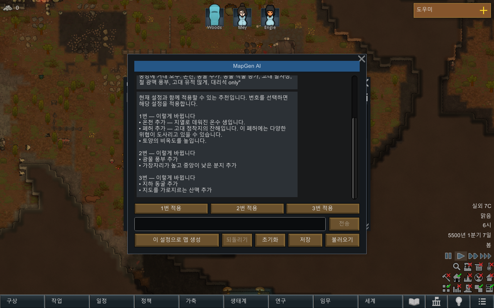

# 추천을 이해할 수 있는 이름과 설명으로 표시

검증 시각: 2026-09-15T22:06:55+09:00. 기준 dev `8507a01`. 최종 DLL `1533cc146f9b7781e53d9bf401d6bf68fb3d3a85e3bcf27621c513632a43c375`.

사용자 지적대로 이전 추천은 내부 이름과 설정 차이를 보여 주었고, 지형 이름을 모르면 결과를 판단하기 어려웠다. 한국어 게임의 `HotSprings` 정의에는 이미 `온천`이라는 이름과 `지열로 데워진 온수 샘입니다`라는 설명이 있었지만 추천 UI에서 사용하지 않았다. [요청 기록](request.md).

## 변경

- 추천과 적용 완료 문구에서 실제 게임의 특징/재료/석재 번역 명칭을 사용한다. 외부 모드도 런타임 DefDatabase의 label/description을 읽는다. 게임 쪽 번역이 없으면 제공된 원문을 유지하며 임의로 모드의 효과를 만들어 설명하지 않는다.
- 특징에는 제공된 설명을 붙인다. 도형은 내부 ID와 radial/split/composite 대신 분지/산맥/둥근 물 영역, 위치, 윤곽, 수정·제거 내용을 설명한다. 식물·비옥도·광물 등도 조정 효과를 문장으로 보여 준다.
- 실제 생성 코드의 부호 규칙을 확인했다. radial 양수는 중앙이 낮고 둘레가 높은 분지, 음수는 중앙이 높은 지형이다. split 양수는 협곡, 음수는 산맥이다. 이름만 추측해 번역하지 않았다.
- 추천 검증, 저장된 명령 적용, Undo와 실패 차단은 유지한다. 모델이 쓴 임의 제목/설명도 계속 표시의 근거로 쓰지 않는다. 진단용 MapStateDescription/원문 로그는 보존한다.
- 이미지 버튼 숨김과 이미지 기능 OFF, Fable 호출 중단 유지.

## 표시 예시

```text
1번 — 이렇게 바뀝니다
• 온천 추가 — 지열로 데워진 온수 샘입니다.
• 폐허 추가 — 고대 정착지의 잔해입니다. 이 폐허에는 다양한 위협이 도사리고 있을 수 있습니다.
• 토양의 비옥도를 높입니다.

2번 — 이렇게 바뀝니다
• 광물 풍부 추가
• 가장자리가 높고 중앙이 낮은 분지 추가
```

이는 새 모델이 만든 설명이 아니라 기존 실제 모델 응답을 새 표시 경로에 넣은 결과다. [전체 문구](native-r1/choices.txt) · [적용 후 문구](native-r1/applied-1.txt) · [오아시스 재료 명칭](native-r1/oasis-applied.txt).



## 검증과 범위

- 오프라인 **122 PASS / 0 FAIL**. 원래116개와 새6개: 번역/설명·실행 시점 조회, 도형 부호 의미, 최상위 fill 우선, 이동·제거와 상태 보존, 구조물 영역·관계 표현, 특징 제거·명시적 동굴 설정.
- 최종 DLL 실제 게임 **32 PASS**. 기존 실제 응답의3개 선택지를 검증·적용·Undo, 적용 문구도 내부 ID 없이 표시, 실제 SoilRich/WaterShallow 번역 조회, 한국어 창 상단/하단 캡처와 GUI 오류0.
- 새 유료 모델 호출0, Fable0. 표시 변경이므로 새 완성맵을 별도로 검증하지 않았다. 기존 응답/명령 및 생성 코드 자체는 변경하지 않았다. 선택 테스트를 위해 실제 게임의 격리 월드를 사용했다.
- 첫 추가 테스트는 잘못된 키 has_caves를 사용해121PASS/1FAIL이었다. 실제 스키마 caves로 fixture를 고친 뒤122PASS를 확인했다. 제품 동굴 생성 코드는 변경하지 않았다. 기존 wildcard AssemblyVersion 경고1개는 남는다.
- 모든 외부 모드의 번역을 이 모드가 제공하는 것은 아니다. 번역이나 설명이 없는 항목은 원문 이름만 보일 수 있다. 설명은 계획을 읽기 쉽게 요약하며 모든 숫자·복합 기하 연산을 자세히 나열하지 않는다. 정확한 상태/명령은 기존 저장·진단 경로에 남는다.

[회귀 결과](final-tests.log) · [빌드](final-build.log) · [게임 결과](native-r1/result.json) · [제품 DLL 해시](native-r1/launch.json) · [임시 모드 정리](native-r1/cleanup.json).

## 재현

```powershell
dotnet run --project dev/Source/Tests/TextToMap.Tests.csproj --no-restore
dotnet build dev/Source/MapGenAI.csproj --no-restore
dotnet build tools/runtime-probe/RuntimeProbe.csproj --no-restore
tools/runtime-probe/launch.ps1 -ReadableChoices docs/analysis/2026-09-15-recommendations/provider-r1 -Output <새 폴더> -Language Korean -Landmarks -Render
```

---
## 작성 이력
- 2026-09-15 22:06 — 사용자 피드백, 표시 수정, 한국어 실게임 검증과 제한 기록.
