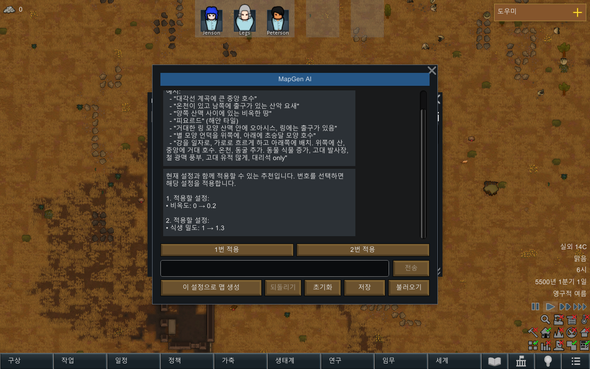
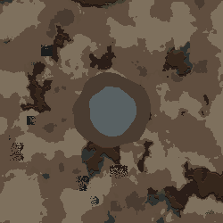
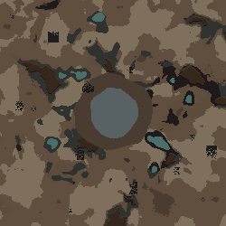

# 추천 모순·오아시스 주변 지형·이미지 버튼 수정

검증 시각: 2026-09-15T00:36:31+09:00. 기준 dev `ea98dd4`. 최종 제품 DLL SHA-256 `f0cbb5beabc25f53ed9a48f3b92c7310abc6f1ef0b99f60ef043d2172b00c3a5`.

## 확인한 원인과 변경

사용자 오아시스 응답은 Pond 특징과 원형 WaterShallow만 넣었고 주변 토양은 없었다. 추천은 action:ask 문장으로 온천+연못을 제시한 다음, 번호 선택 뒤 새 generate를 만들면서 충돌을 발견했다. [사용자 원본](user-evidence/receipt.json), [물만 있는 응답](user-evidence/oasis-water-only.json), [추천 원문](user-evidence/unchecked-recommendations.json), [선택 후 거절된 명령](user-evidence/rejected-selection.json).

- 추천별 실행 params를 포함한 recommend/options를 추가했다. 각각 현재 상태에 독립적으로 적용할 후보이며 1~3개다. 기존 ApplyPatch와 같은 ValidatePatch를 모두 통과해야 화면에 표시된다. 한 후보가 실패해도 batch 전체를 표시하지 않고 한 번 수정 요청한다.
- 번호 목록만 있는 ask와 추천 요청의 즉시 generate는 형식 복구 대상으로 처리한다. 실제 변경 내용으로 추천을 설명하며 모델의 임의 제목/설명은 효과로 표시하지 않는다.
- 번호 입력/적용 버튼은 저장한 명령을 재검증해 그대로 적용한다. 모델 재호출 없이 일반 Undo를 사용한다. 설정 또는 실제 특징/바이옴/산악도 변경, 초기화·되돌리기·프리셋·닫기는 이전 추천을 무효화한다. 여러 후보에 대한 “그래”는 번호를 묻고, 후보가 하나면 적용한다.
- 오아시스 같은 지형을 허용한 요청에는 작은 불규칙 물과 주변 비옥한 토양을 함께 구성하도록 프롬프트를 보완했다. 기존 biome/특징은 유지하고 Pond+별도 물웅덩이의 중복 추가를 피한다. 정확한 원형 정책과 native Oasis의 바이옴 조건은 유지한다.
- 이미지 gate OFF일 때 버튼을 아예 그리지 않는다. 이미지 저장 데이터와 내부 코드는 남아 있으며 기능을 다시 켜지 않았다. Fable/Claude 호출 0회.

## 실제 검증

| 범위 | 결과 |
|---|---|
| 오프라인 회귀 | 116 PASS / 0 FAIL |
| 최종 DLL의 실제 게임 검사 | 45 PASS, 완성맵 2개 포함 |
| 새 Gemini 3.8 Flash 한국어 요청 | 추천 2건·오아시스 2건, 각각 1회 호출로 성공 |
| 추천 선택 | 새 응답 6개 옵션 전부 actual Dialog 적용/Undo 일치 |
| 거절·재시도 | 기록된 온천+연못 거절, 설정 없는 추천 차단, 잘못된 후보 1회 재요청 후 성공/재실패/닫기 취소, 무변경·Undo 미생성 |
| 선택 수명 | 번호 입력, 여러 후보 “그래”, 단일 후보 “그래”, 외부 상태 변경, reset, Undo |
| UI | 실제 Verse 창 캡처에서 이미지 버튼 없음·추천 적용 버튼·채팅·입력창 배치 확인 |

온천 없는 실제 맵: 얕은 물 2269칸(전체 62500칸), 중앙 반경 20% 안의 기름진 토양 3416칸. 온천 있는 맵: 얕은 물 2269칸, 중앙 토양 3348칸, native HotSpring 682칸 및 HotSprings 특징 유지. 전체 물 면적은 각 10% 미만이며 바이옴은 건조관목림이다. 사막의 실제 Oasis 특징을 강제 추가하지 않았다.

[최종 검사](native-final/result.json) · [모델 응답](provider-r1/results.json) · [회귀](final-tests.log) · [빌드](final-build.log) · [설치와 같은 DLL 해시](native-final/launch.json).







## 한계와 실패 기록

검증은 설정 호환성에 대한 것이다. 임의 모드 생성기의 모든 부작용·실제 구조물 배치·모든 자연어 표현과 모델을 보장하지 않는다. 추천 의도 탐지 및 번호 없는 일반 문장의 의미는 여전히 언어 해석의 한계가 있다. 윤곽·비율·구성의 시각적 품질도 모델과 기존 지형 생성 규칙에 좌우된다. 특정 식물/정확한 면적 비율을 보장하지 않는다. 이전 70% 후속 요청의 잘못된 대상과 F03 최초 미반영 원인은 이번 범위에서 해결하지 않았다.

native-r1은 렌더 격리 실행이 추천 재요청 중 진행을 멈춰 중단했고 성공으로 세지 않는다. native-r2는 44검사·2맵에 성공했지만 batchmode 화면은 검게 캡처돼 UI 성공 근거가 아니다. quick-test startup 뒤 배경 실행 설정을 다시 지정한 probe로 ui-r1에서 실제 화면을 확인했다. 최종 native-final은 새 DLL로 전체 45검사·2맵·실제 화면을 재검증했다. 중간 DLL505bd4…의 결과를 최종 개수에 합산하지 않는다. 최초 컴파일의 잘못된 compose 멤버 참조를 compositeOps로 고친 뒤 회귀와 빌드를 수행했다. 기존 wildcard AssemblyVersion 경고 1개는 남아 있다.

## 재현

```powershell
dotnet run --project dev/Source/Tests/TextToMap.Tests.csproj --no-restore
dotnet build dev/Source/MapGenAI.csproj --no-restore
dotnet build tools/runtime-probe/RuntimeProbe.csproj --no-restore
tools/runtime-probe/launch.ps1 -Recommendations docs/analysis/2026-09-15-recommendations/user-evidence -RecommendationReplies docs/analysis/2026-09-15-recommendations/provider-r1 -Output <새 결과 폴더> -Language Korean -Landmarks -Render
```

새 모델 호출: `dotnet run --project tools/provider-probe/ProviderProbe.csproj -- <repo> <새 응답 폴더> recommendations <native-final 폴더>`. 비공개 로컬 API 설정이 필요하고 비용이 발생한다. 원본 사용자 설정·세이브는 변경하지 않는다. 종료된 격리 모드는 marker와 경로 검증 후 cleanup.ps1로 정리한다.

---
## 작성 이력
- 2026-09-15T00:36 — 원인·수정·실패와 최종 검증 결과 보관.
