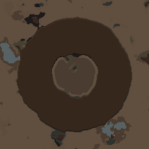
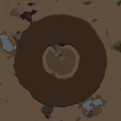

# 도넛 내부 70% 채움 수정 검증

2026-09-15. 개발 기준: dev의 85c5456 이후 변경. 제품 DLL SHA256: `91955863bab902bbfc70b061025aa80476d82d7ec1e4a5d696c160e933ca8596`.

## 재현과 원인

사용자는 “도넛 모양 산 만들어 줘 → 도넛 안에 70%만 비옥한 토양으로 채워줘”에서 내부가 전부 채워졌다고 보고했다. [요청·원본 구분](request.md), [기존 산 응답](line-0058-response.json), [기존 토양 응답](line-0072-response.json)을 보존했다. 파일 번호는 로그를 splitlines로 나눈 위치이며 실제 물리적 행 번호와 다를 수 있다.

원래 응답은 내부 반경 .18에 토양 반경 .15를 사용했다. 명목 면적비는 약69.4%지만 토양의 경계 번짐과 산비탈이 실제 빈 땅을 줄여 결과가100%가 됐다. 기록된 geometry를 독립 계산한 회귀에서 **5013/5013칸**을 재현했고 수정 방식은 **3509/5013칸(약70%)**이다. 실제 완성맵의 기존 응답 재생에서도 내부 **3839/3839칸**이 비옥한 토양이었다. 서로 다른 지형 조건의 수치이므로 같은 분모로 비교하지 않는다.

## 변경

- 반경으로 비율을 흉내내는 대신 기존 도형 ID를 참조하는 `region_fill`을 추가했다. `inside`는 도형 자체, `enclosed`는 닫힌 고리가 둘러싼 구멍이다. 실제 생성된 산비탈·바위·건물·캐릭터·보호 지형을 제외한 칸을 세어 반올림한 quota만 채운다.
- 비율 후속 수정은 채움의 coverage만 바꾼다. 산의 높이·크기를 그대로 두며 이동한 기준 도형을 따라간다. 별도 방향이 없으면 내부 깊은 곳부터, 지정하면 해당 방향부터 채운다. 일반 SDF 채움의 기존 경계 표현은 유지한다.
- 원래 같은 재료가 있으면 quota에 포함한다. 원래 재료만으로 요청 비율을 넘으면 실패를 설명하고 나머지 재료를 지정하도록 안내한다. 소스 부재/열린 고리를 맵 전체로 확대하지 않는다.
- 초기에 칠한 뒤에도 기본 폐허750·DLC 구조물1600이 땅을 바꾸는 실제 실패를 확인했다. 790에서 칠하고 위치 지정 구조물800에 마스크를 제공한 뒤, 1900에서 모드가 칠한 채 유지된 칸만 복구해 남은 사용 가능 면적을 재계산한다. 늦게 생긴 건물·바닥·캐릭터를 보존한다.
- clone/프리셋/Scribe, 실제 Dialog 적용·Undo, dangling source 거부, 플레이어용 한국어·영어 비율 설명을 연결했다. 이미지 기능OFF와 버튼 숨김은 유지한다.

## 최종 검증

- [오프라인 회귀](final-tests.log): **128 PASS / 0 FAIL**. 캡처된 실패,0/50/70/100,방향·구멍·기존 재료·후속 수정·이동·저장·잘못된 참조를 검사한다.
- [제품 빌드](final-build.log): 오류0, 기존 wildcard AssemblyVersion의 CS7035 경고1. 최종 게임 검증 후 제품 DLL은 재빌드하지 않았다.
- [실제 RimWorld 비율 검증](native-verified/result.json): **116 PASS**, 완성맵13개(기존 실패1+수정12), 실제 배경 Map Preview2개. 실제 terrainGrid를 각 채움 전후와 완성맵 끝에서 독립 검사했다. 내부 밖의 지형·모든 바위·높이 보존, 위치 지정 폐허 생존을 확인했다.
- [새 Gemini 3.8 응답](provider-r1/result.json): **5요청 모두 첫 응답 PASS**. 한국어70%2회,70→50후속1회,기존 잘못된 토양만 교체1회,영어70%1회. 요청·생산 프롬프트·응답·병합 상태를 폴더에 보관했다. 이5응답 전부를 위 최종 실제 Dialog/Undo/완성맵에 재생했다. 영어 요청은 한국어 게임 프롬프트에서 보낸 것이며, 영어 게임 프롬프트의 새 모델 호출과 구별한다.
- [영어 실제 게임 검증](english-verified/result.json): **32 PASS**, GUI 오류0. 이전 실제 추천3개의 선택·적용·Undo를 영어 런타임에서 검사하고 창을 직접 캡처했다. [실제 영어 창](english-verified/choices-bottom.png)의 hot springs/hot water spring/ruins 등 일반 명칭과 설명을 눈으로 확인했다.
- 두 최종 launch manifest의 제품 DLL이 위 SHA와 일치한다. 두 cleanup.json 모두 owned 임시 모드 삭제 완료다. Fable/Claude 호출0회.

완성맵 최종 면적(실제 땅/폐허가 달라지므로 분모는 사례마다 다름):

| 사례 | 비옥한 토양 / 사용 가능한 내부 | 비율 |
|---|---:|---:|
| coverage70 | 3158 / 4511 | 70.007% |
| coverage50 | 2150 / 4300 | 50.000% |
| coverage100 | 4444 / 4444 | 100.000% |
| moved70 | 2977 / 4253 | 69.998% |
| natural70 | 2156 / 3080 | 70.000% |
| ellipse70 | 5113 / 7305 | 69.993% |
| positioned-ruin70 | 2535 / 3622 | 69.989% |
| ko70-1 | 2664 / 3806 | 69.995% |
| ko70-2 | 2261 / 3230 | 70.000% |
| followup50 | 2291 / 4581 | 50.011% |
| repair70 | 2823 / 4033 | 69.998% |
| en70 | 2727 / 3896 | 69.995% |

동일한 실제 배경 미리보기에서70%는3111/4444,50%는2222/4444칸이었다. 아래 이미지는 게임의 Map Preview 출력 원본이다.

| 70% | 50% |
|---|---|
|  |  |

## 재현 명령

저장소 루트에서 실행한다. provider-probe만 설정된 Gemini API를 새로 호출한다.

```powershell
dotnet run --project dev/Source/Tests/TextToMap.Tests.csproj --no-restore
dotnet build dev/Source/MapGenAI.csproj --no-restore --nologo
dotnet build tools/runtime-probe/RuntimeProbe.csproj --no-restore --nologo
tools/runtime-probe/launch.ps1 -Coverage docs/analysis/2026-09-15-region-coverage -CoverageReplies docs/analysis/2026-09-15-region-coverage/provider-r1 -Output <새-비율검증-폴더> -Language Korean
tools/runtime-probe/launch.ps1 -ReadableChoices docs/analysis/2026-09-15-recommendations/provider-r1 -Output <새-영어검증-폴더> -Language English -Landmarks -Render
dotnet run --project tools/provider-probe/ProviderProbe.csproj --no-restore -- . <새-응답폴더> coverage docs/analysis/2026-09-15-region-coverage/native-verified
```

## 실패 이력과 남은 범위

초기 tests-r1은125PASS/3FAIL이었다(예외 기대2건과 병합 시 참조검사 누락1건). 테스트·검사를 수정해128PASS로 만들었다. build-r1의 C# 문자열 따옴표 오류와 native-r1의 probe 초기 TypeLoad 오류도 고쳤다. native-r2/native-models-r1은 중간 단계 비율 검사까지 통과했지만 최종 맵 검사가 없었다. 최종 검사를 추가한 native-final/native-final-r2에서 TileGranite 폐허750, native-final-r3에서 AncientConcrete DLC 구조물1600의 토양 덮어쓰기를 발견했다. 단순히 최초 채움 단계를 늦추는 것으로 부족해 위 소유 칸 복구·재계산을 추가했다. native-final-r4는116PASS였고, region_fill의 초기 고도 dispatcher 불필요 경고를 없앤 최종DLL로 native-verified를 다시 통과했다. 성공 수치는 최종 폴더만 기준으로 하며 이전 실행을 합산하지 않는다.

70%는 원 도형의 수학적 면적이나 화면 전체 픽셀의70%가 아니라 **보호 대상을 제외하고 실제 채울 수 있는 칸의70%**다. 칸 반올림 오차가 있다. 이미 목표 재료가 비율보다 많은 지형을 자동으로 다른 재료로 지우지 않는다. 여러 채움의 중첩,1900보다 늦게 지형을 바꾸는 임의 외부 모드,모든 seed/모델/표현/언어/오래된 세이브는 전수 검증하지 않았다. F03 최초 용암 변경의 미반영 원인은 별도 미해결 이슈다. 이미지 기능은 재활성화하지 않았다.
