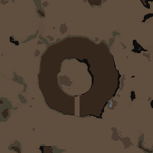
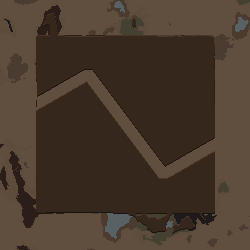
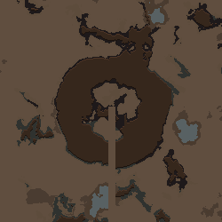

# 산 부분만 깎는 통로 — 2026-09-16

사용자 미리보기에서 도넛 산을 통과한 흙길이 평지와 맵 끝까지 이어졌다. 이전 테스트 문장의 “맵 끝까지 흙길”은 전체 경로에 적용하는 동작이었지만, 일반적인 “산에 출구를 뚫어줘”에도 같은 방식만 제공하는 한계가 있었다. 사용자 “그래 해 봐” 승인에 따라 두 의도를 구별했다. 실제 이전 응답은 [user-replies](user-replies)에 보관했다.

## 변경

- `scope:mountains`: 통로 적용 직전 실제 높이가 0.7 이상인 칸과 경로가 겹치는 부분만 깎는다. 도넛 안쪽과 바깥 평지의 높이·비옥도·채움 재료를 유지한다. 모델이 산 경계를 좌표로 추측해 경로를 줄일 필요가 없다.
- `scope:full` 또는 scope 생략: 기존처럼 시작점부터 끝점까지 전체 경로에 적용한다. 기존 프리셋과 통로는 자동으로 바꾸지 않는다.
- “산 부분만 남기고 바깥 흙길은 지워줘”는 같은 통로의 scope만 수정한다. 경로·폭을 유지한다. 다시 평지까지 흙길을 이어 달라고 하면 full로 되돌린다.
- 산 경계는 모든 통로 적용 전에 한 번 저장한다. 겹치는 통로가 앞선 통로 때문에 자기 적용 영역을 잃지 않는다.
- 실제로 깎는 칸만 예약·장애물 검사한다. 산이 없는 경로는 평지를 바꾸지 않고 “깎을 산이 없습니다”라고 알린다.
- clone, 실제 Scribe, 프리셋, 편집, 되돌리기 및 한국어·영어 설명에 적용 범위를 연결했다. 일반 도형·자연스러운 윤곽 계산은 변경하지 않았다.

## 실제 검증

제품 DLL은 `b488514fecd2cea999aebdd1c3d4b0225439ed0b650795589a65a9ecfcd16d5e`, 수정 전 DLL은 `a3edda95b8b31fc064f870796675979ef844331057bda71ca14f0d0d4ba9ad60`이다. 수정 전 기준 commit은 `3610873937cc9b8c97a29713963450cc2ac2a962`이며 dev에서 작업했다.

| 검사 | 결과와 범위 |
|---|---|
| 제품 빌드 | 오류 0, 기존 CS7035 버전 경고 1 |
| 오프라인 회귀 | 기존 132개 포함 135 PASS / 0 FAIL |
| 새 Gemini 3.8 Flash 요청 | 한국어 7개·영어 2개 모두 기대한 mountains/full로 적용 |
| 실제 맵 재생 | 한국어 7개×2 seed + 영어 2개 = 16맵. 범위·8칸 연결·꺾임점·되돌리기·실제 Scribe/프리셋 검사 통과. 폭 확대 요청은 저장된 12칸도 확인 |
| 원래 평지 보존 | 통로 없는 같은 타일/seed 기준과 5개 결과의 62,500칸을 비교. 원래 열린 칸의 지형 변경 0. 산만 깎는 적용 단계에서도 비산 칸 선택 0, 편집 범위 밖 높이/비옥도/재료/평탄화 변경 0 |
| 기존 성공 사례 비교 | 이전/새 DLL 각각 10맵. 지형·건물·지붕 모든 칸 동일. D04, 용암 재료 교체, 70%·50% 채움, 구조물 배치, 기존 scope 생략 통로 포함 |
| 겹침/산 없음 | 같은 범위의 두 산 통로, 전체 통로 뒤 산 통로, 산 없는 통로 3맵 검사 통과. 마지막은 의도한 무변경 안내 발생 |
| 실제 배경 Map Preview | 한국어 3개·영어 1개, 총 4개 성공. 산 출구·꺾인 통로는 산 경계에서 흙칠이 끝나고, 전체 길은 평지까지 이어지는 모습 확인 |
| 일반 생성 단계 | 잔해/사당을 포함한 기본 전체 생성 단계로 산 출구·꺾인 통로 2맵 추가 확인. 8칸 연결과 지정점 검사 통과, 잔여 장애물 경고 없음 |

전체 완성 맵은 비교 기준 7 + 모델 응답 16 + 이전/새 DLL 비교 20 + 진단 3 + 일반 생성 2 = 48개다. 이 숫자는 각기 다른 목적의 검사 합계이며, 서로 다른 자연어 요청 48개를 새 모델에 보냈다는 뜻이 아니다. 유료 요청은 총 9개다.

정확한 기존 결과 비교와 평지 비교는 무작위 Ancient*, 기본 폐허·사당·도로/동굴 잔해·메카노이드 잔해를 제외한 통제 조건이다. 사용자 지정 구조물은 포함했다. 일반 생성 2맵은 이 단계를 제외하지 않았으며, 무작위 사당·잔해가 모두 이전과 같다는 보장은 하지 않는다. 재현 설정은 각 `cases*.json`, `legacy-inputs/cases.json`, 실행 인수와 DLL 해시는 각 폴더의 `launch.json`에 있다.

실행 명령:

```powershell
dotnet run --project dev/Source/Tests/TextToMap.Tests.csproj --no-restore
dotnet build dev/Source/MapGenAI.csproj --no-restore
dotnet build tools/runtime-probe/RuntimeProbe.csproj --no-restore
dotnet run --project tools/provider-probe/ProviderProbe.csproj --no-restore -- . docs/analysis/2026-09-16-mountain-passages/provider-ko landforms docs/analysis/2026-09-16-mountain-passages/prompts-ko
# 영어는 provider-en / prompts-en으로 실행. 추가 seed 재생에는 새 API 호출 없음.
tools/runtime-probe/launch.ps1 -Output docs/analysis/2026-09-16-mountain-passages/final-ko -LandformSuite docs/analysis/2026-09-16-mountain-passages/cases-ko.json -LandformReplies docs/analysis/2026-09-16-mountain-passages/provider-ko -Language Korean
python -X utf8 tools/evaluate_mountain_passages.py docs/analysis/2026-09-16-mountain-passages
```

새 probe 실행에는 기존 폴더 대신 새 Output을 지정한다. launcher는 새 격리 프로필을 만들고 종료 후 자기 임시 모드를 정리한다. 사용자 설정과 세이브를 불러오지 않는다. 기계 검증 결과는 [evaluation.json](evaluation.json)에 보관했다. 평가기 첫 실행의 잘못된 JSON 키 가정은 실제 `schema_version/state/elevationShapes` 구조로 수정했으며 제품 결함으로 집계하지 않았다.

## 확인 이미지







## 한계와 보존

- 산은 통로 적용 직전 생성 높이로 판정한다. 경로에 걸린 다른 자연 산도 대상이 될 수 있다. 특정 산 ID에만 한정하거나, 이미 생성된 맵에서 암벽을 직접 수정하는 기능은 아니다.
- 산만 깎으면 기존 평지·물은 보존되므로 경로 전체의 물·건물까지 지우는 의미가 아니다. 보존한 평지에서의 접근성과 모든 외부 생성기의 후속 배치는 별도 조건이다.
- 동굴 지붕 유지, 자연스러운 곡선 통로, 반도·군도 개선은 이번 범위가 아니다. 모든 모델·문장·모드 조합·RimWorld 1.5·기존 플레이 세이브의 전수 검증도 아니다.
- Fable/Claude 호출 0, 이미지 기능 OFF·버튼 숨김 유지. 원본 모드/main/v1.6와 이전 복구 태그는 보존한다. 설치 여부와 최종 commit은 출력 폴더의 package/installation/completion 영수증이 정본이다.
