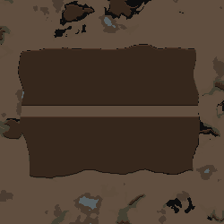

# 추천 후보 수정과 자연스러운 통로

사용자 승인: “그림의 3번에서 저런 곧은 일자 말고 자연스러운 일자 (좀 울퉁불퉁함이 있는) 안되나?” → “그래 해 줘”. 기준은 dev `6720d7fd6add2e0928757aafbaedc638c5a593f8`; 작업 전 복귀 태그는 `dev-before-candidate-refinement-2026-09-19`다. Fable/Claude 호출 금지와 이미지 입력 OFF는 유지한다.

## 변경

- 추천 그림을 본 뒤 `3번 통로를 자연스럽게 해 줘`처럼 후보 하나를 수정할 수 있다. 후보의 전체 제안 상태와 편집 가능한 ID를 모델에 제공하고 `revise` 응답을 받는다. 같은 검증기로 수정 순서를 검사한 뒤 해당 후보와 그림만 바꾼다. 다른 후보와 현재 실제 맵·월드 특징·Undo는 유지한다.
- 번호/적용 버튼을 누를 때 원래 후보와 후속 수정을 하나의 최종 상태로 적용한다. Undo 한 번으로 선택 이전 실제 맵에 돌아간다. 후보 수정 중 잘못된 응답·충돌·직접 generate 응답은 현재 맵에 적용하지 않는다. 마지막 유효한 후보와 그림을 보존한다.
- 자연스러운 통로는 원래 경로와 최소 통행폭을 그대로 두고 양쪽 가장자리만 서로 다른 완만한 노이즈로 확장한다. 직선 방향을 지그재그로 바꾸지 않는다. 강도는 low/medium/high 또는 0..1이고, 생략/none은 이전과 같은 정확한 통로다. 산 전용 출구의 평지 보존과 구조물의 통로 회피에도 같은 면적을 사용한다.
- `다시 반듯하게`는 roughness만 none으로 되돌린다. 기존 edge_roughness 저장 필드를 사용하며 저장 형식은 그대로다.
- 이미 생성 중인 후보를 다시 수정하면 이전 작업은 마무리하되 그 오래된 결과를 표시하지 않는다. 최신 대상만 다시 렌더하고 다른 두 이미지의 텍스처를 재사용한다.
- 후보가 남아 있을 때 대화는 후보 수정으로 해석한다. 현재 맵을 직접 수정하려면 `추천 말고 현재 맵에 바로 …`처럼 명시할 수 있다. 순수 번호 선택은 추가 모델 호출이 없고, 수정 요청 해석은 모델을 호출한다. 렌더·확대는 로컬이다.

구현 진입점은 `RecommendationPlan.Refine/PendingInstruction`, `MapGenParams.ApplyPatches/ValidatePatches`, `Dialog_TextToMap`, `RecommendationPreviews.Replace`, `PassageGeometry.Mask`다. 기존 단일 명령 적용은 한 항목짜리 동일 경로를 사용한다. 대기 후보의 수정 내역은 최대32회이며 선택/새 추천 후 초기화된다.

## 검증 결과

최종 제품 DLL SHA256: `83ce44a7f12991c930d47a593ddb62ed353fcad4895e749b31eb19d46419dffe`.

| 검증 | 실제 결과 |
|---|---|
| 오프라인 회귀 | 기존146 → 최종150 PASS / 0 FAIL |
| 최종 제품 빌드 | 오류0, 기존 버전 문자열 CS7035 경고1 |
| 새 Gemini 3.8 Flash 요청 | 한국어3 + 영어3, 총6/6 후보 번호·최소 필드 수정 성공, 복구 호출 없음 |
| 실제 게임 후보 흐름 | 최종 KO/EN 각각76, 총152검사 PASS; 같은 KO 반복76검사도 PASS |
| 이전 릴리스 결과 보존 | 원래 후보18개 이미지의 전체 픽셀 해시가 이전 MG22 기록과 동일 |
| 선택 전/후 일치 | 원래 후보18개 + 수정 후보2개, 각각62500픽셀 일반 Map Preview와 동일 |
| 완성맵 | KO/EN 자연스러운/반듯한 통로4맵, 연결·최소폭·산 밖 보존·Undo 통과 |
| 임시 모드 | 7실행의 owned probe 폴더 모두 자동 정리 확인 |
| Fable/Claude | 호출0 |

[평가 JSON](evaluation.json), [오프라인 출력](final-tests.log), [한글 실제 검사](native-repeat-ko/result.json), [영어 실제 검사](native-final-en/result.json), [한글 반복 검사](native-repeat2-ko/result.json), [완성맵 실측](full-maps/suite-result.json), [한국어 공급자 기록](provider-ko/results.json), [영어 공급자 기록](provider-en/results.json).

후보 흐름에는 후보1·2 텍스처 동일성, 수정 중 실제 맵/특징/Undo 불변, 충돌 거절 뒤 보존, 잘못된 즉시 적용 차단, none 복귀의 모든 픽셀 일치, 생성 중 연속 교체의 오래된 결과 폐기, 한 번의 Undo, 비옥도 단독 수정도 포함한다. 실제 공급자 응답을 격리 게임에서 SendMessage → StartChat → StructuredChat → HandleResponse로 재생했다. 게임 내 재생 transport는 기록을 반환하므로 API를 추가 호출하지 않았다.

완성맵4개 모두 `outsideChanges=0`, `unclearedSelectedCells=0`, `selectedOpenGround=0`, `blockedCutCells=0`, `dryEndpointConnection=true`다. 실제 절개 칸 수는 KO 자연3502/반듯2426, EN 자연3054/반듯2401이고 최소 폭은 각각12/10칸이다. 서로 다른 고정 타일이므로 두 완성맵의 전체 칸을 직접 비교한 결과는 아니다. 생성 과정 Scribe/preset 왕복과 Undo도 검사했다. 무작위 기본 잔해는 이 통제 비교에서 제외했다.

## 미해결 실패와 범위

**최종 DLL을 사용한 첫 한국어 스트레스 실행 `native-final-ko`는 후보를 생성 중 연속 교체하던 단계에서 네이티브 Mono 충돌로 종료했다. 이 실패는 미해결이다.** [원본 로그](native-final-ko/Player.log), [실행 해시](native-final-ko/launch.json), [정리 영수증](native-final-ko/cleanup.json)를 보존했다. result.json이 없으므로 이 실행을 성공 검사 수에 넣지 않았다.

스택에는 `System.Reflection.RuntimeMethodInfo.InternalInvoke` → `CandidatePreviewProbe.Invoke` → `CandidatePreviewProbe.Tick`이 있다. 이 정보만으로 제품/테스트 하니스/외부 런타임 중 원인을 확정할 수 없다. 같은 제품 DLL·같은 probe DLL·같은 입력의 한국어 재실행 두 번은 모두76검사를 마치고 정상 종료했고 영어도 통과했다. 재현되지 않았다는 사실을 수정 완료로 취급하지 않는다. 같은 상황에서 다시 종료되면 이 기록과 해당 Player.log를 기준으로 원인을 더 좁힌다.

중간 `native-r1-ko/en` 각67검사는 최종 직전 DLL `28675fbcd3179be0ccf3d362a2a3367c00b98118319983a5ae2f9318dba07813` 결과이며 최종 수치에 합산하지 않았다. 이후 실제 요청 전송 경로/생성 중 교체 검사를 보강했다. 공급자 입력의 기본 시스템 프롬프트는 이 중간 실행에서 캡처했으며 최종 제품에서 후보 편집 명령 규약은 같다.

고정 seed·온대림 내륙 평지·기본 DLC/Map Preview 격리 프로필 표본이다. 6개 응답을 모든 자연어/모델에서 성공한다고 확대하지 않는다. 사용자 전체 모드 조합·오래된 세이브·장시간 플레이는 미검증이다. 이미지 입력 재개나 GL 원본 생성기 연동은 이번 작업에 포함되지 않는다.

## 재현 명령

저장소 루트에서 실행한다. 새 실행에는 새 출력 폴더를 쓰고 결과가 저장된 폴더를 덮어쓰지 않는다. 공급자 벤치는 별도 실제 API 호출이 발생하며 모델 설정/키는 기존 비공개 설정을 사용한다.

```powershell
dotnet run --project dev/Source/Tests/TextToMap.Tests.csproj --no-restore
dotnet build dev/Source/MapGenAI.csproj --no-restore --nologo
dotnet build tools/runtime-probe/RuntimeProbe.csproj --no-restore --nologo
dotnet build tools/provider-probe/ProviderProbe.csproj --no-restore --nologo

$evidence = 'docs/analysis/2026-09-19-candidate-refinement'
dotnet tools/provider-probe/bin/Debug/net10.0/ProviderProbe.dll . "$evidence/provider-ko" candidate-refinement "$evidence/native-r1-ko" ko
dotnet tools/provider-probe/bin/Debug/net10.0/ProviderProbe.dll . "$evidence/provider-en" candidate-refinement "$evidence/native-r1-en" en
# native 입력에는 recommend-plain/existing의 before/response fixture도 필요하다.
./tools/runtime-probe/launch.ps1 -Render -Language Korean -CandidatePreviews "$evidence/provider-ko" -Output "$evidence/native-new-ko"
./tools/runtime-probe/launch.ps1 -Render -Language English -CandidatePreviews "$evidence/provider-en" -Output "$evidence/native-new-en"
./tools/runtime-probe/launch.ps1 -Render -Language Korean -LandformSuite "$evidence/map-fixtures/cases.json" -LandformReplies "$evidence/map-fixtures" -Output "$evidence/full-maps-new"
python tools/evaluate_candidate_refinement.py
```

직접 써볼 순서는 [수동 테스트](manual-tests.md)에 정리했다. 아래는 실제 게임의 같은 후보 수정 전/후다.



