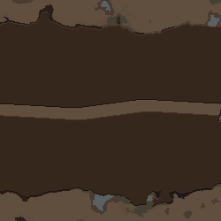
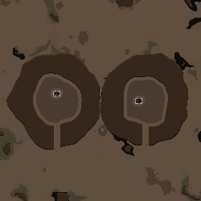
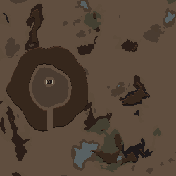

# 대표 지형 조합 안내와 기존 기능 보존 — 2026-09-19

복귀 기준: `dev-before-landform-recipes-2026-09-19` → `d631d60d8443c97b7fb5f3097df471fb170dffaa`. GitHub에 annotated 태그와 대상 commit을 대조해 보관했다. 기준 DLL SHA256은 `7f01ca9d935a7111184cd6f0e7bf6731f521ba2c9aa2b3dad5a6796cb4437fe4`.

최종 제품 DLL SHA256: `7ed1e8ba2d0024de128f1dd304c6a41ae7cbe6abc8feb5854af6746ff30962bb`. RimWorld 1.6, Gemini `gemini-3.8-flash`. 이미지 기능/버튼 OFF, Fable/Claude 호출 0회.

## 변경 범위

제품 변경은 `LandformPrompt.cs`와 `Dialog_TextToMap.BuildSystemPrompt` 연결이다. 칼데라·열린 분지·협곡의 조합과 후속 편집을 한·영으로 안내한다. 기존 composite/passages/region_fill/structure_ops를 사용하며 생성 엔진·저장 형식·기존 파라미터·공급자 설정을 바꾸지 않았다. 별도 계획 모델 호출도 없다.

- 칼데라: 닫힌 산 고리와 명시적으로 요청한 마른 내부 바닥을 순서대로 구성한다. 물/용암 칼데라에 마른 바닥을 강요하지 않는다.
- 열린 분지: 닫힌 원본 고리를 유지하고 출구를 별도 통로로 둬서 내부 채움/폐허 참조를 보존한다.
- 좁은 협곡: 산 덩어리를 먼저 만들고 실제 칸 폭의 통로를 낸다. 넓은 split 골짜기와 구별한다. 기존 산을 뚫는 요청에는 새 산을 추가하지 않도록 안내한다.
- 내부만 넓히면 안쪽 산 경계와 바닥을 함께 조절하고 바깥 경계는 유지한다. 전체 이동, 출구 방향/폭 변경, 출구 닫기, 한 분지의 선택 삭제에서도 관련 ID만 수정한다.

이는 검증한 조합 안내이며 강제 템플릿이나 자연어 의미 보장 장치는 아니다. 이미 성공한 기본 요청에 이 구성을 강요하지 않도록 범위를 명시했다. 런타임 검증 도구에는 독립적인 외부 flood로 계산한 닫힌 내부의 물/산/보행 가능 칸 측정을 추가했다.

## 기준 상태에서 확인한 것

[기준 첫 응답 3개](provider-baseline/result.json)와 [3개 완성맵](baseline-native/suite-result.json), 배경 미리보기 3개를 먼저 확인했다. 칼데라·분지는 기존판에서도 생성됐다. 협곡 응답은 넓은 split 골짜기였고, 추가 통로가 깎을 산을 만나지 않아 무변경 안내가 나왔다. 이를 기존 기능 전체의 실패로 분류하지 않았다. 새 안내 후에는 산을 관통하는 좁은 협곡을 실제로 생성했다.

## 검증 결과

| 항목 | 실제 결과 | 근거 |
|---|---|---|
| 변경 전 회귀 | 139 PASS / 0 FAIL | [baseline-tests.log](baseline-tests.log) |
| 최종 회귀 | 142 PASS / 0 FAIL; 실제 16연속 응답을 고정 회귀로 포함 | [final-tests.log](final-tests.log) |
| 제품 빌드 | 오류 0, 기존 버전 문자열 경고 1 | [build-r1.log](build-r1.log) |
| 최종 새 모델 응답 | 한국어 21 + 영어 3 = 24개, 첫 응답 보존 | provider-r1-shapes/en/ko/basic/two/features |
| 후속 조건 보존 | 분지 7 + 기본 6 + 독립 분지 3 = 16편집, 비요청 상태 전체 비교 | [evaluation.json](evaluation.json) |
| 새 완성맵 | 33개: 대표 한영 6, 분지 7×2 seed, 기본 6, 독립 분지 3, 특징 2, 원래 게임 생성 단계 포함 2 | native-r1-*/native-seed1-ko/native-features/native-normal |
| 새 요청 배경 미리보기 | 12개, 실제 렌더·물/구조물/통로 측정 | 각 native 폴더의 preview-result.json/PNG |
| 기존 성공 결과 보존 | 기존 10사례 + 직전 복합 7사례 = 17맵 재생. 지형·건물·지붕 62,500칸씩 이전 결과와 완전 일치 | [legacy-new](legacy-new/suite-result.json), [compound-new](compound-new/suite-result.json) |
| 저장/되돌리기 | 실제 Dialog Undo, native Scribe, preset roundtrip | 각 native 결과의 undo/after.json/scribe.xml |
| 특징 기본 동작 | 온천+화창함 추가, 온천만 제거. 다른 상태 보존 및 실제 HotSpring 지형 생성/제거 | [native-features](native-features/suite-result.json) |
| 검출기 확인 | 바깥 경계 오변경·비율100칸 오류·막힌 통로1칸을 넣으면 같은 검사가 실패 | evaluation.json detectorPositiveControls |

전체 새 유료 요청은 27개(기준3 + 최종24). 전체 새 완성맵 실행은 53개(기준3 + 신규33 + 기존재생17). 배경 미리보기는 총17개(기준3 + 신규12 + 기존재생2). 기존 비교 기준은 직전 버전의 보관된 실측 결과이며, 이전 버전을 이번에 다시 실행했다고 주장하지 않는다.

분지 확대 예: 사용 가능한 내부가 5,892칸에서 10,145칸으로 늘었고 비옥토는 각각 4,124칸/7,101칸이다. 두 번째 값의 수학적 목표는 7,101.5칸이며 기존 float32 비율 처리의 반올림 경계에서 아래 칸을 선택한다. 검사 도구가 double 반올림 결과 7,102만 허용해 처음 실패했고, 정수 칸 반올림 범위(목표와 차이≤0.501칸)를 독립적으로 판정하도록 고쳤다. 제품의 기존 채움 계산은 바꾸지 않았다.

## 직접 확인한 모양

좁은 협곡:



독립 분지 두 개와 오른쪽 전체 제거 후:




## 한계

- Geological Landforms의 전체 지형이나 그 모드 생성기를 직접 연동한 기능은 아니다. 해안 반도/군도, 두꺼운 지붕 동굴, 복잡한 세계 강은 후속 범위다.
- 산 출구는 산 밖의 원래 토양·물을 보존한다. `native-seed1-ko/basin-06`에서 산 절개와 통로의 실제 잘린 칸은 모두 통과했지만, 바깥까지 **12칸 폭으로 이어지는 이동 검사**는 false였다. 그 결과를 보존했으며 외부 평지까지 같은 폭의 이동을 보장하지 않는다.
- 닫힌 내부의 기하학적 경계에는 산비탈 칸이 포함된다. 이를 사용 가능한 평지/채움 분모와 구별한다. 물은 측정한 내부에서 0칸이었다. 자연물/식물/모든 돌덩어리를 삭제하는 기능은 아니다.
- 상태는 실제 이전 응답에서 이어지지만 완성맵은 상태별 서로 다른 고정 타일에서 재생한다. 같은 타일의 후속 변경마다 자연 생성 결과가 동일하다는 검사는 아니다.
- 원래 게임 생성 단계를 포함한 2맵 외에는 비교를 안정화하기 위해 기본 무작위 고대 잔해/폐허/사당 등 일부 단계를 제외했다. 장시간 날씨 효과, 기존 사용자 세이브, 임의 모드·언어·모델·모든 seed는 전수 검증하지 않았다.
- 프롬프트 안내는 모델의 해석을 돕는 규칙이다. 모든 문장이 같은 지형과 편집 계획을 만든다고 보장하지 않는다. 경계를 넘는 이동이나 복잡한 중첩은 추가 검증 대상이다.

## 재실행

```powershell
dotnet run --project dev/Source/Tests/TextToMap.Tests.csproj --no-restore
python -X utf8 tools/evaluate_landform_recipes.py docs/analysis/2026-09-19-landform-recipes
./tools/runtime-probe/launch.ps1 -LandformSuite docs/analysis/2026-09-19-landform-recipes/provider-r1-ko/cases.json -LandformReplies docs/analysis/2026-09-19-landform-recipes/provider-r1-ko -Language Korean -Output <새 폴더>
```

위 명령에는 추가 모델 호출이 없다. 최초 모델 실험은 실제 런타임에서 캡처한 프롬프트를 `ProviderProbe`의 landforms/plan-sequence 모드로 전달했다. 요청·프롬프트·원문 응답·이전/이후 상태를 함께 보존했다. 예시 문장은 [manual-tests.md](manual-tests.md)에 있다.
