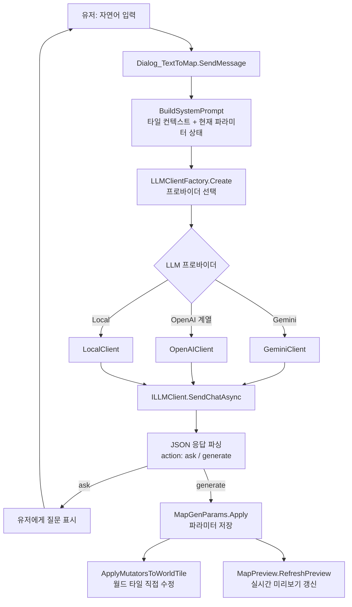
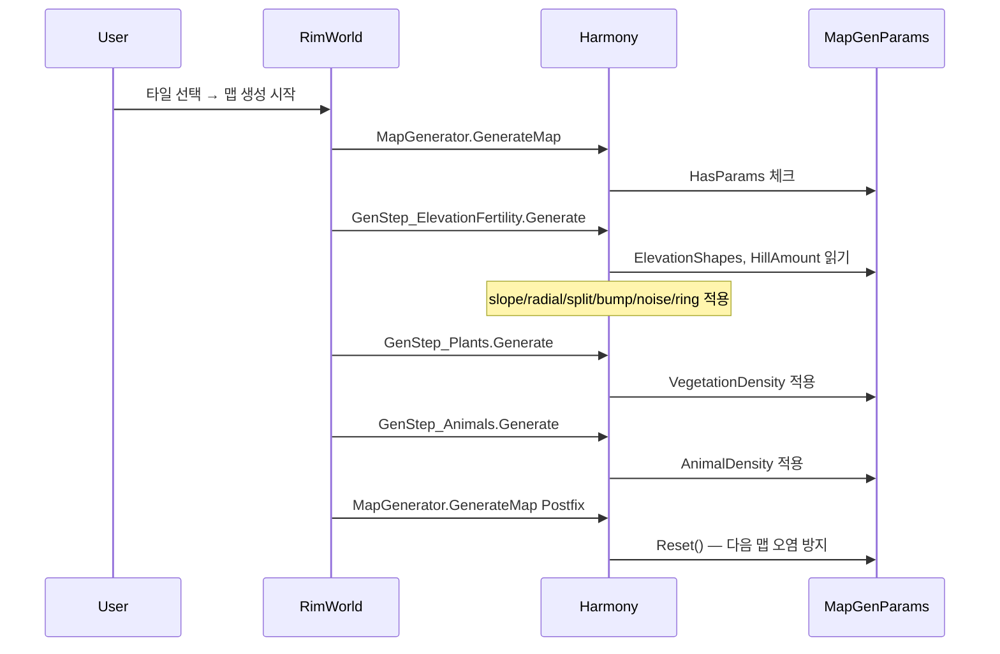
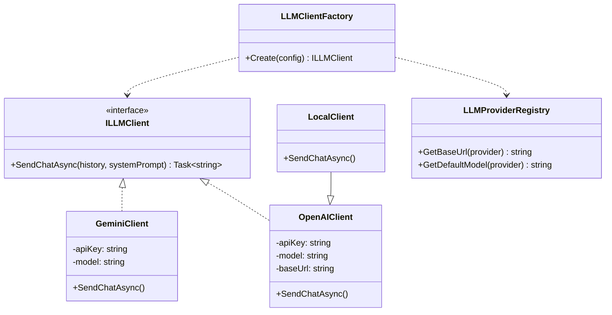
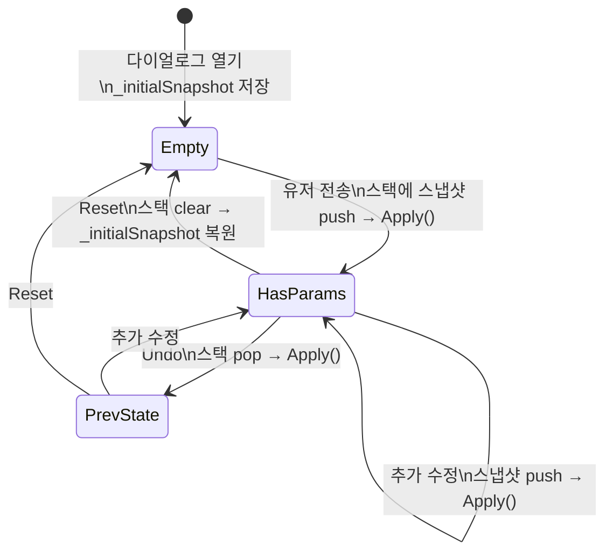

# MapGen AI — 시스템 흐름 다이어그램

## 1. 전체 데이터 흐름

```mermaid
flowchart TD
    A[유저: 자연어 입력] --> B[Dialog_TextToMap.SendMessage]
    B --> C[BuildSystemPrompt\n타일 컨텍스트 + 현재 파라미터 상태]
    C --> D[LLMClientFactory.Create\n프로바이더 선택]
    D --> E{LLM 프로바이더}
    E -->|Gemini| F[GeminiClient]
    E -->|OpenAI 계열| G[OpenAIClient]
    E -->|Local| H[LocalClient]
    F & G & H --> I[ILLMClient.SendChatAsync]
    I --> J[JSON 응답 파싱\naction: ask / generate]
    J -->|ask| K[유저에게 질문 표시]
    J -->|generate| L[MapGenParams.Apply\n파라미터 저장]
    L --> M[ApplyMutatorsToWorldTile\n월드 타일 직접 수정]
    L --> N[MapPreview.RefreshPreview\n실시간 미리보기 갱신]
    K --> A
```

## 2. 맵 생성 파이프라인 (실제 게임 시작 시)

```mermaid
sequenceDiagram
    participant User
    participant RimWorld
    participant Harmony
    participant MapGenParams

    User->>RimWorld: 타일 선택 → 맵 생성 시작
    RimWorld->>Harmony: MapGenerator.GenerateMap
    Harmony->>MapGenParams: HasParams 체크
    RimWorld->>Harmony: GenStep_ElevationFertility.Generate
    Harmony->>MapGenParams: ElevationShapes, HillAmount 읽기
    Note over Harmony: slope/radial/split/bump/noise/ring 적용
    RimWorld->>Harmony: GenStep_Plants.Generate
    Harmony->>MapGenParams: VegetationDensity 적용
    RimWorld->>Harmony: GenStep_Animals.Generate
    Harmony->>MapGenParams: AnimalDensity 적용
    RimWorld->>Harmony: MapGenerator.GenerateMap Postfix
    Harmony->>MapGenParams: Reset() — 다음 맵 오염 방지
```

## 3. LLM 클라이언트 구조

```mermaid
classDiagram
    class ILLMClient {
        <<interface>>
        +SendChatAsync(history, systemPrompt) Task~string~
    }
    class GeminiClient {
        -apiKey: string
        -model: string
        +SendChatAsync()
    }
    class OpenAIClient {
        -apiKey: string
        -model: string
        -baseUrl: string
        +SendChatAsync()
    }
    class LocalClient {
        +SendChatAsync()
    }
    class LLMClientFactory {
        +Create(config) ILLMClient
    }
    class LLMProviderRegistry {
        +GetBaseUrl(provider) string
        +GetDefaultModel(provider) string
    }

    ILLMClient <|.. GeminiClient
    ILLMClient <|.. OpenAIClient
    LocalClient --|> OpenAIClient
    LLMClientFactory ..> ILLMClient
    LLMClientFactory ..> LLMProviderRegistry
```

## 4. 파라미터 상태 관리 (Undo/Reset)

```mermaid
stateDiagram-v2
    [*] --> Empty: 다이얼로그 열기\n_initialSnapshot 저장

    Empty --> HasParams: 유저 전송\n스택에 스냅샷 push → Apply()

    HasParams --> HasParams: 추가 수정\n스냅샷 push → Apply()

    HasParams --> PrevState: Undo\n스택 pop → Apply()

    HasParams --> Empty: Reset\n스택 clear → _initialSnapshot 복원

    PrevState --> HasParams: 추가 수정
    PrevState --> Empty: Reset
```
